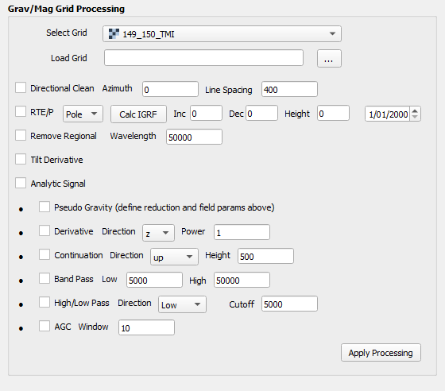

# Structural Geophysics Tool v 0.2.3
 Simple Potential Field Calcs to assist WAXI/Agate Structural Geophysics Course    
 https://waxi4.org   
 https://agate-project.org    
    
       

## Grav/Mag Filters   
   
**Reduction to the Pole**    
$`H_{RTP}(k_x, k_y) = \frac{k \cos I \cos D + i k_y \cos I \sin D + k_x \sin I}{k}`$   
Converts magnetic data measured at any inclination and declination to what it would be if measured at the magnetic pole.
Where     
- kx and ky : The wavenumber components in the x and y directions.
- k = The total wavenumber magnitude = sqrt{kx2 + ky2}   
- I : Magnetic inclination (in radians).
- D : Magnetic declination (in radians).
- i : Imaginary unit.

**Reduction to the Equator**    
$`H_{RTE}(k_x, k_y) = \frac{k \cos I \cos D + i k_y \cos I \sin D + k_x \sin I}{k \cos I \cos D - i k_y \cos I \sin D + k_x \sin I}`$     
Converts magnetic data measured at any inclination and declination to what it would be if measured at the magnetic equator.
Where   
- kx and ky : The wavenumber components in the x and y directions.
- k = The total wavenumber magnitude = sqrt{kx2 + ky2}
- I : Magnetic inclination (in radians).
- D : Magnetic declination (in radians).
- i : Imaginary unit. 
   
**Analytic Signal**    
$`A(x, y) = \sqrt{\left(\frac{\partial f}{\partial x}\right)^2 + \left(\frac{\partial f}{\partial y}\right)^2 + \left(\frac{\partial f}{\partial z}\right)^2}`$   
Computes the total amplitude of the gradients, independent of field inclination or declination.
Useful for locating edges of potential field sources (e.g., faults or contacts).   

**Tilt Angle**    
$`T = \tan^{-1}\left(\frac{\frac{\partial f}{\partial z}}{\sqrt{\left(\frac{\partial f}{\partial x}\right)^2 + \left(\frac{\partial f}{\partial y}\right)^2}}\right)`$   
Enhances the contrast of geological features by highlighting gradients relative to the vertical component.
Where   
df/dz : Vertical derivative of the field.
df/dx , df/dy : Horizontal derivatives of the field.   
   
**Continuation**    
$`H(k) = e^{-k h}`$   
Where   
h > 0 for upward continuation.   
h < 0  for downward continuation.   
   
**Vertical Integration**   
$`H(k_x, k_y) = \frac{1}{k}`$  
When applied to an RTE or RTP image provides the so called Pseudogravity result    
Where    
k = sqrt{kx2 + ky2} .   
   
## Frequency Filters   
   
**Band Pass**
$`H(k) = e^{-(k - k_c)^2 / (2 \sigma^2)} - e^{-(k + k_c)^2 / (2 \sigma^2)}`$   
The band-pass filter retains frequencies within a specified range, suppressing both low and high frequencies outside this range.
Where   
kc : The central frequency of the band.
sigma : The width of the frequency band.   

**Directional Band Pass**   
Butterworth High-Pass Filter
$`H(k) = \frac{1}{1 + \left(\frac{k_c}{k}\right)^{2n}}`$    
The Butterworth filter attenuates frequencies below the cutoff kc while preserving higher frequencies.    
H(k) : Filter response as a function of wavenumber k.    
k : Wavenumber (spatial frequency).    
kc : Cutoff wavenumber, related to the cutoff wavelength by kc = \frac{1}{\text{cutoff wavelength}}.    
n : Filter order, determining the sharpness of the transition. Higher \( n \) makes the filter more selective.   
    
Directional Cosine Filter   
$`H(k_x, k_y) = \left| \cos(\theta - \theta_c) \right|^p`$   
The Directional Cosine Filter emphasizes or suppresses frequency components along a specific direction.   
H(kx, ky): Filter response as a function of wavenumber components kx and ky.   
theta = \arctan\left(\frac{k_y}{k_x}\right) : Angle of the frequency component.   
thetac : Center direction (in radians), representing the direction to emphasize.   
p : Degree of the cosine function. Higher \( p \) sharpens the directional emphasis.   
   
**High Pass**    
$`H(k) = 1 - e^{-k^2 / (2 k_c^2)}`$   
The high-pass filter removes low-frequency components (long wavelengths) while retaining high-frequency components (short wavelengths).
Where    
kc : The cutoff frequency where the filter begins attenuating lower frequencies.   

**Low Pass**    
$`H(k) = e^{-k^2 / (2 k_c^2)}`$   
The low-pass filter suppresses high-frequency components (short wavelengths) while preserving low-frequency components (long wavelengths).
Where: kc : The cutoff frequency where the filter begins attenuating higher frequencies.   

**Remove Regional**   
$`H(k) = e^{-k^2 / (2 k_c^2)}`$
The low-pass filter suppresses high-frequency components (short wavelengths) while preserving low-frequency components (long wavelengths).
Where    
kc : The cutoff frequency where the filter begins attenuating higher frequencies.   
   
**Automatic Gain Control**    
$`AGC(x, y) = \frac{f(x, y)}{\text{RMS}(f(x, y), w)}`$   
Where    
RMS(f, w)  is the root mean square of the data over a window w.   
   
**Radially averaged power spectrum (but needs testing!)**    
$`P(k) = \frac{1}{N_k} \sum_{(k_x, k_y) \in k} |\text{FFT}(f)|^2`$   
Where    
P(k) is the radially averaged power spectrum, and Nk is the number of samples in the radial bin.   
   
## Gradient Filters   
   
**Derivative**    
$`\frac{\partial f}{\partial u} = \frac{\partial f}{\partial x} \cos\theta + \frac{\partial f}{\partial y} \sin\theta`$   
Where   
theta is the angle defining the direction of the derivative (x,y or z).   
   
**Total Horizontal Gradient**   
$`THG(x, y) = \sqrt{\left(\frac{\partial f}{\partial x}\right)^2 + \left(\frac{\partial f}{\partial y}\right)^2}`$   
   
## Convolution Filters   
**Mean**
Applies a mean filter using a kernel of size \( n \times n \).   
   
**Median**   
Applies a median filter using a kernel of size \( n \times n \).   
   
**Gaussian**   
Applies a Gaussian filter with a specified standard deviation.    
   
**Directional**   
Apply directional filter (NE, N, NW, W, SW, S, SE, E)    
   
**Sun Shading**   
Computes relief shading for a digital elevation model (DEM) or other 2D grids.

## Gridding   
**Import points**   
Imports point data in csv or xyz formats   

**GFridding**   
Grids point data using either Clough Tocher or IDW gridding algoithms   
   
      
# Installation
- Dowload the zip file from the green **<> Code** button and install the zip file in QGIS using the plugin manager   
   
# Inputs   
- Supports data geotiff, grd, ers formats   
   
# How To   
1) Load a raster image from file
- If a GRD grid (Oasis Montaj) is selected, the plugin will attempt to load CRS from the associated xml file, if this is not possible a CRS of EPSG:4326 is assumed. In any case the grid is saved as geotiff.
2) Whatever layer is shown in the layer selector will be the one processed by whatever combination of filters are selected by check boxes. 
- All processed files will be saved as geotiffs or ERS format files depending on the original format, will be saved in the same directory as the original file, and will have a suffix added describing the processing step.
- If a RTP or RTE calculation is performed, it is possible to define the magnetic field manually or the IGRF mag field parameters can be assigned based on the centroid of grid, plus date and survey height
- If a file exists on disk it will be overwritten, although QGIS plugins don't always like saving to disks other than C: on Windows.
- Length units are defined by grid properties except for Up/Down Continuation (so Lat/Long wavelengths should be defined in degrees!)
3) If multiple processing steps are required, first apply one process, select the result and then apply subsequent steps.

# Code development
- Plugin construction - Mark Jessell using QGIS Plugin Builder Plugin https://g-sherman.github.io/Qgis-Plugin-Builder/    
- Calcs ChatGPT and Mark Jessell
- IGRF calculation - https://github.com/klaundal/ppigrf  
- GRD Loader & Radially averaged  power spectrum Fatiando a Terra crew & Mark Jessell https://www.fatiando.org/
- Example geophysics data in image above courtesy of Mauritania Govt. https://anarpam.mr/en/      

