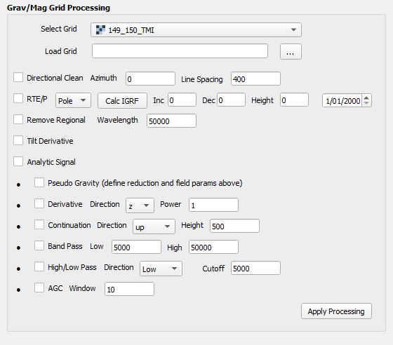

# Structural Geophysics Tool v0.3.8
 Simple Potential Field and other Geophysical Grid Calcs to assist WAXI/Agate Structural Geophysics Course    
 https://waxi4.org   and  https://agate-project.org    
    
 This plugin is available directly within **QGIS** using the Plugin Manager, however the latest **ArcGIS Pro** version or QGIS version with all new bugs will always be at this site.   

**<a href="https://tectonique.net/sgtools_data/SGTool%20Cheat%20Sheet.pdf">Cheat Sheet (Thanks Chops)</a>**&nbsp;**&nbsp;|&nbsp;&nbsp;&nbsp; <a href="https://tectonique.net/sgtools_data/Structural%20Geophysics%20Tools.pdf">Download Basic Help Document</a>**&nbsp;&nbsp;&nbsp; |&nbsp;&nbsp;&nbsp;  **<a href="https://tectonique.net/sgtools_data/SGTools_large.mp4">Ctrl-click on link to watch demo video</a>**
    
       

# changelog=0.3.8
      * retain std df/dz for Euler solutions
      * Line-noise filter: new Wedge width setting; fix the filter removing too little noise (the opposite spectral lobe was not being filtered); Scale now defaults to 1   
      * Add Apply the same steps to another grid (Utils tab): repeats the processing steps recorded in a grid's history on another grid, recalculating inclination and declination from IGRF for RTP, RTE and differential RTP. Also a Processing algorithm   
      * Improved and debugged Direction Cosine/Butterworth filter: min/max line spacing inputs define the noise band, noise estimate is zero-centred before scaling and subtraction
      * Add live Preview (FFT Filters, Conv + Stats and Utils tabs): one temporary layer that updates as parameters change, for the current map extent or a subsampled grid, with Keep to save the full resolution result
      * Add provenance metadata: how each saved file was made (creation time, source file(s) and their XML, operation and parameters, chained through successive steps) is embedded in saved GeoTIFFs, or in a filename.sgt.xml sidecar for files that cannot carry it
      * Add Read metadata and Save as XML buttons to the Utils tab to show a grid's processing history in a new window or save it as filename.sgt.xml
      * Calculations now run as cancellable QGIS background tasks (Apply Processing, Keep, B-spline gridding, worms, normalise, RGB to grey, grd conversion), with Cancel buttons on each tab
      * Filters exposed as QGIS Processing algorithms (SGTool group) for the modeler, batch processing and scripting
      * Apply Processing moved to a fixed bar at the top of the tabs, next to the Preview controls
      * Fix repeated entries in menus and duplicated signal connections when the plugin is reopened
      * Fix first recalculation failing to overwrite an existing output grid on Windows
      * ArcGIS Pro: Euler CSV includes std df/dz, Euler toolbox tool repaired, directional filter updated to match QGIS
      * Generalise XYZ importer for new variations
      0.3.7
      * Add native python Multilevel BSpline code converted from SAGA
      * Add native python MRVBF/MRRTF/Slope RGB code converted from SAGA
      * Remove DTM Curvature but keep code for now
      * Remove WTMM from GUI but keep code for now
      * Fix clash with modern python for worms calcs
      0.3.6
      * Variable RTP code thanks to Gordon Cooper   
      * Add windowed spatial anisotropy calcs   
      * Add chain length calculations for linear features  
      * Add RGB picker tool to convert LUT picture to grayscale   
      0.3.5   
      * Redo GUI so it removes need for .ui file and is now scrollable
      * redo RTE code following suggestion from google AI   
      * Almost complete ARCGIS Pro version now available with full GUI   
      * Translations of GUI for French, Spanish, Portuguese (Portugal and Brazil) and Mandarin
      0.3.4
      * Fix bug with inclination declination signs for RTE_P now that images always north  
      * Check for commas as decimal separators and replace with decimal points     
      0.3.3
      * change to single decimal versions
      * Don't add mean back for THG calcs
      * Replace raster copy code so it works for negative and positive delta z on linux/macos
      * Add networkx, shapely and geopandas  as requirement so linux is happy
      0.3.01   
      * Fix median removal and resoration for FFT filters   
      0.3.00   
      * Add Spatial stats and convolutions to ArcGIS Pro toolbox
      * Move ArcGIS Pro files to their own directory    
      * Update IGRF to allow up to 2030    
      * Move Euler and IGRF to calcs directory   
      * Compatibility with both QGIS4/QT6 and QGIS3/QT5   
      * Add RGB triplets as LUT definition for RGB to greyscale convertor   

   
Full changelog <a href="https://raw.githubusercontent.com/swaxi/SGTool/refs/heads/main/metadata.txt">Metadata</a>   

# Installation
## QGIS:
1) Either:   
- Download the zip file from the green **<> Code** button and install the zip file in QGIS using the plugin manager for the version on github or   
- Install directly from the QGIS plugin manager from the plugin repository   
   
2) If you get an warning of the type **The following Python packages are required but not installed: scikit-learn** or any other module name the best way to manage this is to install the QGIS Plugin called **qpip** and open it. It will tell you which libraries are missing and allow you to install the correct versions.   
       
   The packages required for specific functions are:   
   **matplotlib** Radial Power Spectrum   
   **scikit-learn** BSDWorms, PCA, ICA   

   If you don't use these functions, there is no need to install the extra packages.   
      

   
## ArcGIS Pro:
1) Download and unzip this respository and store somewhere safe.
2) In order to run python code in ARCGIS Pro you will need to manually add some python libraries so SGTool has everything it needs:
- a) Open Package Manager: Click the Project tab on the ribbon and select Package Manager from the side menu. Access Environment Manager (Gear icon to right of active environemnt): 
  - i) Click the Environment Manager button (top right) to open the management dialog.
  - ii) Clone the Environment: Locate the environment you wish to copy (usually arcgispro-py3) and click the Clone button next to it.
  - iii) Set Destination: In the Clone Environment dialog, provide a name and path for your new environment or leave it as the default.
  - iv) Finalize: Click OK. The cloning process may take several minutes.
- b) Once the cloned environment has been created, search for and install the following packages, **if they are not already installed**:
  - scipy
  - matplotlib
  - scikit-learn
  - pyproj>=3.7.2
  - networkx
  - shapely
  - geopandas
- c) In the ArcGIS Pro Catalogue area, go to Add toolbox and select the file **GeophysicalProcessor.pyt** in the **ArcGIS** directory in this repository. 
- d) Double click on the new Geophysical Processing Toolbox to get the list of functions that can be run, and select  **Launch** then **run** to launch the SGTool GUI. Alternatively you can access individual tools from the same Toolbox.    

   
# Inputs   
- QGIS version supports data geotiff, grd, ers and Noddy (grv & mag) grid formats plus any grid format already supported by QGIS. ArcGIS Pro version supports any raster format supported by ArcGIS Pro.
- Supports csv, dat, xyz plus any point format already supported by QGIS
- Existing Noddy mag and grav files can be found at the Atlas of Structural Geophysics: https://tectonique.net/asg/
- New Noddy models can be calculated using the Windows version at https://tectonique.net/noddy/OpenNoddy_installer.exe or a python wrapper at https://github.com/cgre-aachen/pynoddy
   
# Capabilities   

## Live Preview (QGIS only)   

The **FFT Filters**, **Conv + Stats** and **Utils** (Threshold to NaN) tabs have a fixed bar at the top with **Apply Processing** on the left and the preview controls to its right, so they stay visible while you scroll the filter list.   

- **Preview**: tick it to see the selected filter without writing any files. A single temporary layer called `<grid><suffix>_preview` is added to the project and is replaced in place each time a parameter changes, so layers do not accumulate. Updates wait a fraction of a second after the last edit, so typing a value does not trigger a calculation for every digit.   
- **One filter at a time**: while previewing, ticking a second filter unticks the first, and editing a filter's parameters selects that filter. Filters that cannot be previewed (Differential RTP, local anisotropy, chain and streamline length, MRVBF, PCA, ICA, Euler deconvolution, and the clipping polygon) are disabled until Preview is switched off.   
- **Map extent**: calculates at full resolution for the area currently shown in the map canvas, so panning or zooming updates the preview. Filter edge effects appear along the edges of the view, and very large views are block-averaged to at most 2000 cells on the longest side.   
- **Subsampled grid**: calculates for the whole grid after block-averaging it to at most 600 cells on the longest side. This is quick, but filters set in pixels (convolutions, window statistics, AGC) then act on the coarser cells, and line noise cannot be seen if the preview cell size exceeds the line spacing. Use Map extent for those.   
- **Keep**: calculates the previewed filter at full resolution, adds it as a normal permanent layer (with the usual name and suffix), and switches preview off.   
- **Unticking Preview** (or closing the plugin, or changing tab) discards the temporary layer. Unticking the last ticked filter clears the image but keeps preview mode on, so ticking a filter brings it straight back.   
- The preview layer is shown with bilinear resampling when zoomed in to reduce the blocky look of a coarse preview.   

## Background Calculations (QGIS)   

Calculations run as QGIS background tasks, so QGIS stays usable while they work, progress shows in the task manager and status bar, and a calculation can be cancelled. This covers everything started by **Apply Processing** (all the filters, statistics, MRVBF, PCA/ICA, boundary outline and Euler deconvolution, including several ticked together), **Keep** from the live preview, B-spline gridding, worms, grid normalisation, RGB to grey-scale and Geosoft `.grd` conversion.   

- **Cancel**: each tab has a **Cancel** button (on the Grid + Wavelets tab it is "Cancel running calculation"), and QGIS's own task manager has one too. The buttons are only enabled while a calculation is running, and **Apply Processing** is disabled so a second one cannot be started on top.   
- **How quickly it stops**: cancelling is cooperative. It takes effect between the steps of a job and inside long loops (Euler deconvolution, worms levels, B-spline levels, normalising a folder of grids), so a very long single filter finishes its current step first. A cancelled job saves nothing, and the filters you ticked stay ticked so you can run it again.   
- **Safe to keep working**: the settings are snapshotted when you press Apply, so editing the dialog, changing the selected grid or using the preview while a calculation runs does not affect it.   
- **Messages** raised during a calculation (for example "geographic grids need projected coordinates") are shown when it finishes, and a failure is reported in the message bar with the details in the Python console.   
- The **live preview** itself stays in the foreground on purpose: it is limited to a small grid so it responds as you type.   
- Importing XYZ/CSV/DAT points and the GRASS IDW dialog still run in the foreground.   

## Processing Algorithms (QGIS)   

The filters are also available as QGIS **Processing** algorithms in the **SGTool** group of the Processing Toolbox, so they can be used in the graphical modeler, the batch-processing dialog and Python scripts, for example `processing.run("sgtool:derivative", {"INPUT": "grid.tif", "DIRECTION": 0, "POWER": 1, "OUTPUT": "grid_d1z.tif"})`. They call the same calculation code as the plugin dialog, so for the same settings the results are identical, and each result is a GeoTIFF with its provenance embedded (see below), chained to the provenance of the input.   

**Output files**: the output is optional. Choose a file and it is used as given. Leave it empty and the result is saved **next to the input grid, named after it plus the processing step**, exactly as the dialog does (`grid.tif` gives `grid_d1z.tif`, `grid_UC_500.tif`, `grid_BP_50000_5000.tif`, `grid_DirC.tif` and so on), and is added to the project under the same name. Euler solutions go to `<grid>_estimates_SI_<n>.csv` and B-spline gridding to `<points>_<field>_bspline.tif`, both next to their input. In a batch run each input's result is therefore written beside that input. If a result with that name is already open in QGIS the old layer is removed first and the file replaced, as in the dialog. (In the toolbox the empty output may be labelled "Skip output": for these algorithms that means "use the automatic name".)   

Available: remove line noise (directional Cosine/Butterworth, with the option to output the noise estimate instead of the corrected grid), reduction to the pole and to the equator, continuation, vertical integration, remove regional, band pass, high/low pass, AGC, derivative, tilt angle, analytic signal, total horizontal gradient, mean, median, Gaussian and directional filters, sun shading, windowed statistics, threshold to NaN, Euler deconvolution (one structural index per run, written as a CSV including the std of df/dz), PCA, ICA and multilevel B-spline gridding. FFT-based algorithms have an optional FFT buffer size (0 = automatic). Also **Apply the steps of a processing history to a grid** (see below). Differential RTP, MRVBF, anisotropy, worms and the live preview are only in the dialog for now.   

Algorithms can be cancelled from the Processing dialog; as in the dialog, a single FFT step cannot be interrupted part-way.   

## Provenance Metadata (QGIS)   

Every file the plugin saves records how it was made. For **GeoTIFFs** this is stored inside the file itself, in its own GDAL metadata domain (`SGTOOL`, item `provenance_xml`), the same way the Noddy grid import stores its header, so it travels with the file when it is copied or renamed. The operation, creation time and SGTool version are also written as ordinary GeoTIFF metadata items (`SGTOOL_OPERATION`, `SGTOOL_CREATED`, `SGTOOL_VERSION`) so they show in the QGIS layer properties. Files that cannot carry metadata (shapefiles, csv and txt outputs) get a small XML sidecar instead, named after the file with `.sgt.xml` added (for example `pts.csv.shp.sgt.xml`); the same sidecar is the fallback if a GeoTIFF cannot be updated (for example because it is locked). The record contains:   

- **When**: the date and time of creation (with time zone) and the SGTool version.   
- **Source**: the path of the file or files it was made from, plus any XML metadata those sources carry: their own SGTool record (embedded or sidecar, so each step contains the steps before it and a chain of processing can be followed back to the original data), GDAL `.aux.xml` (the band statistics, without the bulky histogram), and other `.xml` sidecars such as the `.grd.xml` that accompanies Geosoft grids.   
- **How**: the operation and the parameters that were set to create it (for example azimuth, line spacing and scale for the directional filter, or structural index and window size for Euler deconvolution).   

**Reading it back**: on the **Utils** tab, select a grid and press **Read metadata of selected grid**. A new window shows the history (this step, then each earlier step nested beneath the file it produced, with the parameters used and the source statistics) and the raw XML. If the grid has no SGTool metadata, a message at the top of the map canvas says so. **Save as XML**, to the right of the read button, writes the same record to a file called `<grid file>.sgt.xml` in the grid's folder (for example `grid_DirC.tif.sgt.xml`), replacing any existing file of that name, so it can be kept, shared or opened in other tools. It is a snapshot: the GeoTIFF's own embedded record is left untouched, and the exported file is removed if the plugin later overwrites or deletes that grid.   

Sidecars record the output's size and modified time when written, so a sidecar left beside a file that another program has since overwritten can be recognised (`sidecar_status()` in `calcs/sgt_metadata.py` reports `current`, `stale`, `missing` or `unknown`). When the plugin overwrites or deletes a file it also removes any old-style sidecar for it. Metadata embedded in a GeoTIFF needs no such clean-up as it is part of the file, and files made by earlier SGTool versions with a `.sgt.xml` sidecar are still read.   

This covers filter outputs, gridding, imports and conversions, Euler solutions and window statistics, PCA/ICA, MRVBF, worms, grid normalisation and boundary outlines. Temporary preview layers are not saved to disk so carry no record, but a result made with **Keep** does. Recording provenance can never stop a calculation: if it fails, a message is printed to the Python console and processing carries on. (Grids made through the GRASS IDW dialog are written by that dialog and do not get a sidecar yet.)   

## Line-Noise Filter Update (QGIS)   

The **wedge** (half-width, degrees) of the directional line-noise filter is now a setting on the FFT Filters tab (default 45). **Fix**: the filter previously treated only one of the two opposite lobes of the noise spectrum, so about half of the noise was left in; both are now filtered. Because of that, a Scale of 2 or more now over-subtracts, so **Scale** now defaults to 1.   

## Replaying a Processing History (QGIS)   

On the **Utils** tab, select a grid that was made by SGTool and press **Apply the same steps to another grid...**. The steps in its provenance (see below) are listed oldest first with their recorded settings; tick the ones to repeat (**Apply**), tick which intermediate results to keep (**Save**, all ticked by default; an unticked step's file is deleted once the next step has been made from it, and the last result is always kept; its history still lists every step), choose the grid to apply them to and press **Apply steps**. Each step runs on the result of the one before, and every result is saved next to the new grid with the usual names (`grid.tif`, `grid_RTP.tif`, `grid_RTP_d1z.tif`, ...) and its own provenance, so the new grid has a complete history of its own. The last grid is added to the project. It runs as a background task and can be cancelled.   

- **Magnetic reductions**: reduction to the pole, reduction to the equator and differential RTP depend on the field direction where the survey was flown, so the inclination and declination are recalculated from the IGRF model for the new grid's location (from its centre, or from its four corners for differential RTP) and a survey date you can set. The new grid needs a coordinate system with an EPSG code. Grids that carry their own inclination and declination, such as Noddy models, use those.   
- Steps that cannot be repeated (gridding, Euler deconvolution, component analysis, anything made from several grids) are shown greyed with the reason, and skipped. Histories written by the dialog and by the Processing algorithms can both be replayed.   
- The **Apply the steps of a processing history to a grid** Processing algorithm does the same for batch use: give the grid to process and a grid, or a saved `.sgt.xml` file, to take the history from.   

## Grav/Mag Filters   
   
**Reduction to the Pole**    
$`H_{RTP}(k_x, k_y) = \frac{k \cos I \cos D + i k_y \cos I \sin D + k_x \sin I}{k}`$   
Converts magnetic data measured at any inclination and declination to what it would be if measured at the magnetic pole.
Where     
- kx and ky : The wavenumber components in the x and y directions.
- k = The total wavenumber magnitude = sqrt{kx2 + ky2}   
- I : Magnetic inclination (in radians).
- D : Magnetic declination (in radians).
- i : Imaginary unit.

**Reduction to the Equator**    
$`H_{RTE}(k_x, k_y) = \frac{k \cos I \cos D + i k_y \cos I \sin D + k_x \sin I}{k \cos I \cos D - i k_y \cos I \sin D + k_x \sin I}`$     
Converts magnetic data measured at any inclination and declination to what it would be if measured at the magnetic equator.
Where   
- kx and ky : The wavenumber components in the x and y directions.
- k = The total wavenumber magnitude = sqrt{kx2 + ky2}
- I : Magnetic inclination (in radians).
- D : Magnetic declination (in radians).
- i : Imaginary unit. 
   
**Variable (Differential) Reduction to the Pole**   
Accounts for the spatial variation of inclination and declination across a survey area by applying a Taylor-series expansion of the standard RTP operator (Cooper & Cowan, 2005). The IGRF field is computed at the four grid corners and the centre, then bilinearly interpolated to build spatially varying inclination and declination grids. The expansion is evaluated at 13 perturbed inc/dec pairs and combined to give a single corrected output.   
Outputs: `_DRTP` (corrected field), `_DRTP_inc` and `_DRTP_dec` (the interpolated inclination and declination fields used).   
Recommended for surveys covering several degrees of latitude/longitude where a single inc/dec value would introduce systematic phase or amplitude errors.   
Based on: Cooper, G.R.J. & Cowan, D.R. (2005), *Computers & Geosciences* 31, 989–999. https://doi.org/10.1016/j.cageo.2005.02.005   

**Continuation**    
$`H(k) = e^{-k h}`$   
Where   
h > 0 for upward continuation.   
h < 0  for downward continuation.   
   
**Vertical Integration**   
$`H(k_x, k_y) = \frac{1}{k}`$  
When applied to an RTE or RTP image provides the so called Pseudogravity result    
Where    
k = sqrt{kx2 + ky2} .   
   
## Frequency Filters   
   
**High Pass Filter**

$$H(k) = \begin{cases} 
0 & \text{if } k \leq k_{low} \\
\frac{1}{2}\left(1 - \cos\left(\pi \frac{k - k_{low}}{k_{high} - k_{low}}\right)\right) & \text{if } k_{low} < k < k_{high} \\
1 & \text{if } k \geq k_{high}
\end{cases}$$

The high-pass filter removes low-frequency components (long wavelengths) while retaining high-frequency components (short wavelengths) with a smooth transition to reduce ringing artifacts.

Where:
- $k$ : Current wavenumber magnitude $\sqrt{k_x^2 + k_y^2}$
- $k_{low} = \frac{2\pi}{\lambda_c + w/2}$ : Lower transition boundary
- $k_{high} = \frac{2\pi}{\lambda_c - w/2}$ : Upper transition boundary  
- $\lambda_c$ : Cutoff wavelength
- $w$ : Transition width (in same units as wavelength)

**Low Pass Filter**

$$H(k) = \begin{cases} 
1 & \text{if } k \leq k_{inner} \\
\frac{1}{2}\left(1 + \cos\left(\pi \frac{k - k_{inner}}{k_{outer} - k_{inner}}\right)\right) & \text{if } k_{inner} < k < k_{outer} \\
0 & \text{if } k \geq k_{outer}
\end{cases}$$

The low-pass filter removes high-frequency components (short wavelengths) while retaining low-frequency components (long wavelengths). Optional smooth transition reduces potential ringing artifacts.

Where:
- $k$ : Current wavenumber magnitude $\sqrt{k_x^2 + k_y^2}$
- $k_{inner} = \frac{2\pi}{\lambda_c + w/2}$ : Inner transition boundary
- $k_{outer} = \frac{2\pi}{\lambda_c - w/2}$ : Outer transition boundary
- $\lambda_c$ : Cutoff wavelength
- $w$ : Transition width (optional, in same units as wavelength)

**Band Pass Filter**

$$H(k) = H_{high}(k) \times H_{low}(k)$$

Where:

***High-pass component:***
$$H_{high}(k) = \begin{cases} 
0 & \text{if } k \leq k_{h,low} \\
\frac{1}{2}\left(1 - \cos\left(\pi \frac{k - k_{h,low}}{k_{h,high} - k_{h,low}}\right)\right) & \text{if } k_{h,low} < k < k_{h,high} \\
1 & \text{if } k \geq k_{h,high}
\end{cases}$$

***Low-pass component:***
$$H_{low}(k) = \begin{cases} 
1 & \text{if } k \leq k_{l,inner} \\
\frac{1}{2}\left(1 + \cos\left(\pi \frac{k - k_{l,inner}}{k_{l,outer} - k_{l,inner}}\right)\right) & \text{if } k_{l,inner} < k < k_{l,outer} \\
0 & \text{if } k \geq k_{l,outer}
\end{cases}$$

The band-pass filter isolates features within a specific wavelength range by combining high-pass and low-pass components with smooth transitions.

Where:
- $k$ : Current wavenumber magnitude $\sqrt{k_x^2 + k_y^2}$
- $k_{h,low} = \frac{2\pi}{\lambda_{low} + w_h/2}$ : High-pass lower transition boundary
- $k_{h,high} = \frac{2\pi}{\lambda_{low} - w_h/2}$ : High-pass upper transition boundary
- $k_{l,inner} = \frac{2\pi}{\lambda_{high} + w_l/2}$ : Low-pass inner transition boundary
- $k_{l,outer} = \frac{2\pi}{\lambda_{high} - w_l/2}$ : Low-pass outer transition boundary
- $\lambda_{low}$ : Low cutoff wavelength (removes longer wavelengths)
- $\lambda_{high}$ : High cutoff wavelength (removes shorter wavelengths)
- $w_h$ : High-pass transition width
- $w_l$ : Low-pass transition width

**Directional Band Pass**   
Removes combined directional and high pass filtered data from original data, with scaling function modify extent of feature suppression.   
   
***Butterworth High-Pass Filter***
$`H(k) = \frac{1}{1 + \left(\frac{k_c}{k}\right)^{2n}}`$    
The Butterworth filter attenuates frequencies below the cutoff kc while preserving higher frequencies.    
H(k) : Filter response as a function of wavenumber k.    
k : Wavenumber (spatial frequency).    
kc : Cutoff wavenumber, related to the cutoff wavelength by kc = \frac{1}{\text{cutoff wavelength}}.    
n : Filter order, determining the sharpness of the transition. Higher \( n \) makes the filter more selective.   
    
***Directional Cosine Filter***    
$`H(k_x, k_y) = \left| \cos(\theta - \theta_c) \right|^p`$   
The Directional Cosine Filter emphasizes or suppresses frequency components along a specific direction.   
H(kx, ky): Filter response as a function of wavenumber components kx and ky.   
theta = \arctan\left(\frac{k_y}{k_x}\right) : Angle of the frequency component.   
thetac : Center direction (in radians), representing the direction to emphasize.   
p : Degree of the cosine function. Higher \( p \) sharpens the directional emphasis.   

**Remove Regional**   
Remove a 1st order (dipping plane) or 2nd order (parabolic plane) regional from data. 
   
**Automatic Gain Control**    
$`AGC(x, y) = \frac{f(x, y)}{\text{RMS}(f(x, y), w)}`$   
Where    
RMS(f, w)  is the root mean square of the data over a window w.   
   
**Radially averaged power spectrum (but needs testing!)**    
$`P(k) = \frac{1}{N_k} \sum_{(k_x, k_y) \in k} |\text{FFT}(f)|^2`$   
Where    
P(k) is the radially averaged power spectrum, and Nk is the number of samples in the radial bin.   
   
## Gradient Filters   
   
**Derivative**    
$`\frac{\partial f}{\partial u} = \frac{\partial f}{\partial x} \cos\theta + \frac{\partial f}{\partial y} \sin\theta`$   
Where   
theta is the angle defining the direction of the derivative (x,y or z).   
   
**Total Horizontal Gradient**   
$`THG(x, y) = \sqrt{\left(\frac{\partial f}{\partial x}\right)^2 + \left(\frac{\partial f}{\partial y}\right)^2}`$   
   
**Analytic Signal**    
$`A(x, y) = \sqrt{\left(\frac{\partial f}{\partial x}\right)^2 + \left(\frac{\partial f}{\partial y}\right)^2 + \left(\frac{\partial f}{\partial z}\right)^2}`$   
Computes the total amplitude of the gradients, independent of field inclination or declination.
Useful for locating edges of potential field sources (e.g., faults or contacts).   
       
**Tilt Angle**    
$`T = \tan^{-1}\left(\frac{\frac{\partial f}{\partial z}}{\sqrt{\left(\frac{\partial f}{\partial x}\right)^2 + \left(\frac{\partial f}{\partial y}\right)^2}}\right)`$   
Enhances the contrast of geological features by highlighting gradients relative to the vertical component.
Where   
df/dz : Vertical derivative of the field.
df/dx , df/dy : Horizontal derivatives of the field.   
   
## Convolution Filters   
**Mean**
Applies a mean filter using a kernel of size n x n .   
   
**Median**   
Applies a median filter using a kernel of size n x n .   
   
**Gaussian**   
Applies a Gaussian filter with a specified standard deviation.    
   
**Directional**   
Apply directional filter (NE, N, NW, W, SW, S, SE, E)    
   
**Sun Shading**   
Computes relief shading for a digital elevation model (DEM) or other 2D grids.

## Spatial Statistics   
Calculates 1D statistics in a windowed grid
   
**Min**   
Calculate Minimum of values around central pixel for given window size  

**Max**   
Calculate Maximum of values around central pixel for given window size  

**Standard Deviation**   
Calculate Standard Deviation of values around central pixel for given window size  

**Variance**   
Calculate Variance of values around central pixel for given window size  

**Kurtosis**   
Calculate Kurtosis of values around central pixel for given window size  

**Skewness**   
Calculate Skewness of values around central pixel for given window size  

**Local Anisotropy**   
Uses the structure tensor (second-moment matrix) of local Sobel gradients to quantify the strength and orientation of linear structure at each pixel. The gradient products are smoothed over a window (Gaussian or box) of the specified size.   

Structure tensor elements:   
$`J_{11} = \text{smooth}(I_x^2), \quad J_{12} = \text{smooth}(I_x I_y), \quad J_{22} = \text{smooth}(I_y^2)`$   

Eigenvalues:   
$`\lambda_1 = \tfrac{1}{2}\!\left(J_{11}+J_{22}+\sqrt{(J_{11}-J_{22})^2+4J_{12}^2}\right), \quad \lambda_2 = \tfrac{1}{2}\!\left(J_{11}+J_{22}-\sqrt{(J_{11}-J_{22})^2+4J_{12}^2}\right)`$   

Anisotropy magnitude (saliency), normalised to [0, 1] by the 99th-percentile value:   
$`\text{AnisoMag} = \text{clip}\!\left(\tfrac{\lambda_1 - \lambda_2}{p_{99}},\; 0,\; 1\right)`$   

Dominant orientation:   
$`\theta = \tfrac{1}{2}\arctan\!\left(\tfrac{2J_{12}}{J_{11}-J_{22}}\right) \bmod 180°`$   

Returns two layers: `_SS_AnisoMag` (0–1 saliency; 0 = flat or isotropic, 1 = strong linear feature) and `_SS_AnisoOrient` (0–180° dominant strike).   

**Chain Length**   
Scores each pixel by the total size of the connected anisotropy component it belongs to. Two active pixels (those exceeding Aniso threshold) are linked if they lie within Search radius pixels of each other and their orientations differ by at most Angle tolerance degrees. The direction of the link is unconstrained so the full width of a multi-pixel-wide lineament is treated as a single entity. Connected components are found with Union-Find; every pixel in a component receives the same score equal to the number of pixels in that component.   
Returns: `_SS_ChainLen`   

**Streamline Length**   
From each active pixel (exceeding Aniso threshold) traces forward and backward along the orientation field using sub-pixel bilinear interpolation and double-angle orientation averaging. The path continues while anisotropy remains above the threshold and the step-to-step orientation change stays within Angle tolerance. The total forward + backward path length in pixels is the score. Unlike Chain Length, Streamline Length follows the curvature of a lineament and produces a continuous (non-integer) distance measure.   
Returns: `_SS_StreamLen`   

**MRRTF / MRVBF / Slope**   
Calculate DTM classification based on hill top & valley bottom curvature and slope  and combines as RGB.Converted from SAGA code  
   
## Multivariate Statistical Analysis   
**Principal Component Analysis**   
Principal Component Analysis (PCA) transforms correlated variables into orthogonal components that maximize variance, creating a new coordinate system where the first component captures the most variance.   
   
**Independent Component Analysis**   
Independent Component Analysis separates a multivariate signal into additive, statistically independent components by maximizing non-Gaussianity, often used to recover source signals from mixed observations.     
   
## Euler Deconvolution   
**Euler Deconvolution**   
Reliable Euler Deconvolution provides estimates of depth to gravity or magnetic sources based on analysis of gradients. Code derived from Reliable Euler Deconvolution by Felipe F. Melo and Valéria C.F. Barbosa https://github.com/ffigura/Euler-deconvolution-python.   
   
**Independent Component Analysis**   
Independent Component Analysis separates a multivariate signal into additive, statistically independent components by maximizing non-Gaussianity, often used to recover source signals from mixed observations.     
   
## Gridding   
**Import points**   
Imports point data in csv, ASEG-GDF2 dat or xyz formats. For xyz line data, tie lines can optionally be loaded as well.   

**Gridding**   
Grids point data using either BSpline (Converted from SAGA code) or IDW built-in gridding algoithms   
   
## Wavelets   
**BSDWorms**   
Use wavelet transforms to build multilevel "worms", saves out a single csv file of points (for use in 3D visualisation), and optionally a shapefile (for use in QGIS). Code from Frank Horowitz's bsdwormer  https://bitbucket.org/fghorow/bsdwormer/   
    
## Utilities   
**Threshold to NaN**   
Define upper or lower bound (or range) for which values will be set to NaN (i.e. excluded from display). Useful when reprojected images produce an unwanted border.      
   
**Create Clipping Polygon**   
Create one or more polygons outlining the available data in the grid. Useful, amongst other things, for clipping worms to grid area..     
   
**Normalise Grids**   
Normalise the means and standard deviations of a series of grids in a directory to minimse mismatches in merged grids. Does not consider overlaps between grids, simply standardises data and removes a first or second order regional.     
   
**Convert LUT to grayscale**   
Takes a 3-band registered RGB image and converts it to a monotonically increasing grayscale image if you provide the correct Look Up Table, either as matplotlib CSS Colour names (https://matplotlib.org/stable/gallery/color/named_colors.html#css-colors) or as a list of RGB triplets.   

   
# How To   
1) Load a raster image from file
- If a GRD grid (Oasis Montaj) is selected, the plugin will attempt to load CRS from the associated xml file, if this is not possible a CRS of EPSG:4326 is assumed. In any case the grid is saved as geotiff.
2) Whatever layer is shown in the layer selector will be the one processed by whatever combination of filters are selected by check boxes. Scratch/temporary grids (e.g. "memory" outputs from other processing tools) can be processed directly, since QGIS/ArcGIS still backs them with a readable file even though they aren't permanently saved.
- All processed files will be saved as geotiffs, and will be saved in the same directory as the original file, and will have a suffix added describing the processing step.
- If a RTP or RTE calculation is performed, it is possible to define the magnetic field manually or the IGRF mag field parameters can be assigned based on the centroid of grid, plus survey date, or embedded geotiff metadata if the source of the tif was a Noddy grid file..
- If a file exists on disk it will be overwritten, although QGIS plugins don't always like saving to disks other than C: on Windows, and can't overwrite a file if the grid is open in another program.
- Length units are defined by grid properties except for Up/Down Continuation (so Lat/Long wavelengths should be defined in degrees!)
3) If multiple processing steps are required, first apply one process, select the result and then apply subsequent steps.

# Alternatives   
There are several excellent Open Source or at least free alternatives to this plugin if you don't want to use QGIS, or want to do things this plugin can't:   
- Fatiando Harmonica https://www.fatiando.org/harmonica/
- GravMagSuite https://github.com/fcastro25/GravMagSuite
- GSSH https://cires1.colorado.edu/people/jones.craig/GSSH/index.html
- UBC Toolkit https://toolkit.geosci.xyz/content/Demos/SyntheticFilters.html
- gravmag https://github.com/birocoles/gravmag
- Fourpot https://sites.google.com/view/markkussoftware/gravity-and-magnetic-software/fourpot
- GridMerge https://www.gridmerge.com.au/home
- GammaSpec https://www.gammaspec.com.au/ 

# Code development
- You can explore the codebase and functionality at the <a href="https://deepwiki.com/swaxi/SGTool">DeepWiki Code description</a>   
- Calcs ChatGPT, Claude and Mark Jessell
- Plugin construction - Mark Jessell using QGIS Plugin Builder Plugin https://g-sherman.github.io/Qgis-Plugin-Builder/    
- IGRF calculation -  using pyIGRF https://github.com/ciaranbe/pyIGRF
- GRD Loader & Radially averaged power spectrum Fatiando a Terra crew & Mark Jessell https://www.fatiando.org/
- Example geophysics data in image above courtesy of Mauritania Govt. and USGS https://anarpam.mr/en/     
- Worming of grids uses Frank Horowitz's bsdwormer  https://bitbucket.org/fghorow/bsdwormer/
- Wavelet Transform base code - https://github.com/PyWavelets/pywt 
- Multilevel BSpline Gridding and MRVBF converted to python from SAGA code -https://saga-gis.sourceforge.io/
- Euler Deconvolution uses Felipe F. Melo and Valéria C.F. Barbosa's Reliable Euler method https://github.com/ffigura/Euler-deconvolution-python   
- Variable RTP modified from code kindly supplied by Gordon Cooper, Uni Witwatersrand, see Cooper & Cowan, Computers & Geosciences 31 (2005) 989–999   https://doi.org/10.1016/j.cageo.2005.02.005

