>  Structural Geophysics Tools v 0.2.12

Structural Geophysics Tools (*sgtool*) is a plugin to allow simple
geophysical processing methods to be applied to data directly within
QGIS. The primary motivation for developing the tool was to allow
students to manipulate their datasets within the same QGIS environment
that they use for manual interpretation. It provides a subset of tools
available in other commercial or Open-Source packages in an Open-Source
environment without the need to install anything other than QGIS and the
plugin itself.

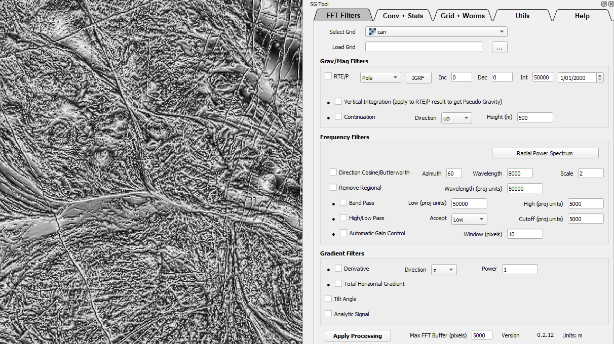

Contents

[1. Install Plugin [2](#_Toc187825283)](#_Toc187825283)

[2. Load and Process Grid [3](#_Toc195537644)](#_Toc195537644)

[3. Geophysical Filters [4](#_Toc187825285)](#_Toc187825285)

[4. Frequency Filters [7](#_Toc187825286)](#_Toc187825286)

[5. Gradient Filters [11](#_Toc187825287)](#_Toc187825287)

[6. Convolution Filters [13](#_Toc195537648)](#_Toc195537648)

[7. Spatial Statistics [16](#_Toc195537649)](#_Toc195537649)

[8. Import point or line data [19](#_Toc187825290)](#_Toc187825290)

[9. Gridding [19](#_Toc187825291)](#_Toc187825291)

[10. Wavelet Transforms [19](#_Toc195537652)](#_Toc195537652)

[11. Utilities [22](#_Toc195537653)](#_Toc195537653)

[12. Code development [28](#_Toc195537654)](#_Toc195537654)

[13. Examples [29](#_Toc195537655)](#_Toc195537655)

Install Plugin

1)  The easiest method is to install the release version from the QGIS
    Plugin Manager

2)  You can also download the latest version (which will generally be
    newer than the version on the plugin repository), from
    <https://github.com/swaxi/sgtool> as a zip file and then install
    manually via the QGIS Plugin Manager

3)  SGTool requires several external libraries to be installed to
    function completely (currently *scikit-learn, scikit-image, shapely,
    matplotlib, PyWavelets*) If you get an error of the
    type **ModuleNotFoundError: No module named 'sklearn'** or any other
    module name you can install it directly from the QGIS Python Console
    (Menu Plugins-\>Python Console) and then type in (for the
    ***sklearn*** example):

> **!pip3 install scikit-learn**
>
> for other modules that may be missing, the module name to be installed
> with !pip3 install is generally the same as the name specified in the
> error (***scikit-learn***, ***scikit-image*** and ***PyWavelets***
> (loaded as ***sklearn***, ***skimage and pywt respectively***) are
> special cases) so for example if ***shapely*** was missing the command
> would be:
>
> **!pip3 install shapely**
>
> If the error persists, there may be a clash between python versions on
> your computer, and you can manually override the PYTHONPATH for QGIS
> so it points to the correct python by setting it in QGIS in the
> Settings-\>Options menu in the Systems-\>Environment area and adding a
> custom variable:
>
> Variable: ***PYTHONPATH***
>
> Value: ***path to your site-packages directory*** (unfortunately this
> varies from machine to machine), so in the qgis console type:
>
> ***import sys***
>
> ***sys.executable***

and paste in the response to the second command in the **Value** area
for **PYTHONPATH**

Load and Process Grid

1)  Load a raster image from file

> 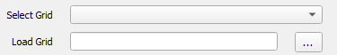 alt="P43#yIS1" />
>
> \- This tool can directly load TIF, ERS or GRD files, although you can
> use the standard QGIS Raster Grid import dialog to load many other
> formats that will then be available for processing.
>
> \- If a GRD grid (Oasis Montaj) is selected, the plugin will attempt
> to load the CRS from the associated xml file, unfortunately (and by
> design) xml files come in a huge number of variations, and the
> *sgtools* code searches for an EPSG definition, and if it fails it
> defaults to EPSG:4236 (i.e. a degree-based projection).
>
> \- In any case the grid is saved as geotiff in the same directory as
> the original grid.
>
> \- The plugin flags if it can’t find a valid
> CRS with a warning, but you need to manually set the CRS in QGIS:

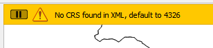

> \- The plugin also provides the units at the bottom right of the
> plugin for the currently selected layer, which can be important as
> some filters don’t work with degree-based projections:
>
>  alt="P52#yIS1" />

b\) Whatever layer is shown in the layer selector, present in each tab,
will be the one processed by whatever combination of filters are
selected by check boxes, **but must exist as a file, this plugin cannot
process grids that are only loaded in memory**.

> **<u>- Again, most tools require the grid to be already saved to
> disk</u>**
>
> \- All processed files will be saved as the same format as the source
> file e.g. geotiffs, ERS format files or any other QGIS-recognised
> format, will be saved in the same directory as the original file and
> will have a suffix added describing the processing step.
>
> \- If a Reduction to Pole (RTP) or Reduction to Equator (RTE)
> calculation is performed, it is possible to define the magnetic field
> manually or the IGRF mag field parameters can be assigned based on the
> centroid of grid, plus date and survey height
>
> \- If a file exists on disk, it will be overwritten, although QGIS
> plugins don't always like saving to disks other than C: on Windows,
> and can't overwrite a file if the grid is open in another program, or
> even another instance of QGIS.
>
> \- Length units are defined by grid properties except for Up/Down
> Continuation (so Lat/Long wavelengths should be defined in degrees!)

c\) If multiple processing steps are required, first apply one process,
select the result and then apply subsequent steps.

Geophysical Filters

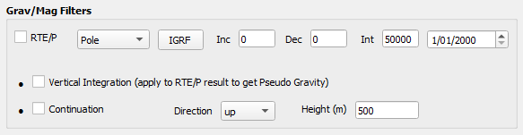

***\[ \_XXX \] indicates the suffix which will be added to the original
grid name, with an \_# indicating that the parameter value controlling
the filter is also added, e.g. \_UC_500 indicates an upward continuation
of 500m.***

***For Fourier Domain Filtering (Grav/Mag, Frequency and Gradient
filters) the maximum buffer can be defined. Smaller buffers reduce
calculation time at the expense of stronger edge effects so start with a
smaller buffer to see if you can live with the edge effects before
increasing it as needed. The max buffer is internally limited by the
size of the grid. Buffers are adjusted to be the next largest factor of
a power of 2, 3 or 5 as this reduces calculation time, especially for
large grids.***

***See section 12 for examples of all filters.***

**Reduction to the Pole \[ \_RTP \]**

*Converts magnetic data measured at any inclination and declination to
what it would be if measured at the magnetic pole. Centres anomalies
over causative body use for magnetic latitude \> +/- 20 degrees, usually
viewed in pseudo colour to highlight absolute value changes. Good place
to start*

**  
**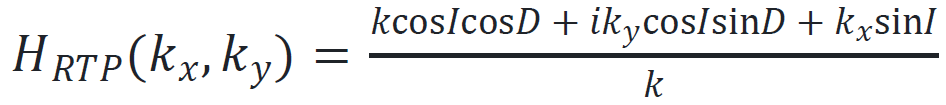  
Where

kx and ky : The wavenumber components in the x and
y directions.

k = The total wavenumber magnitude = sqrt{kx2 +
ky2}

I : Magnetic inclination (in radians).

D : Magnetic declination (in radians).

i : Imaginary unit.

<table>
<colgroup>
<col style="width: 49%" />
<col style="width: 50%" />
</colgroup>
<thead>
<tr>
<th style="text-align: center;">
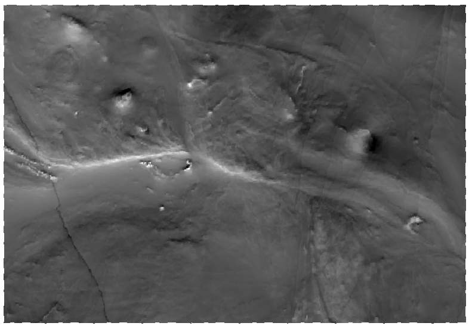

<em><strong>ogrm_usgs_mag_tmi</strong></em>
</th>
<th style="text-align: center;">
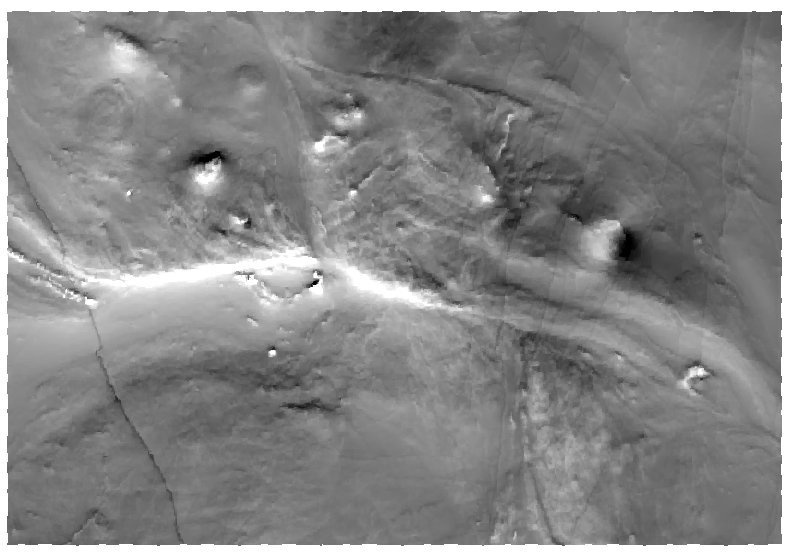

<em><strong>_RTP</strong></em>
</th>
</tr>
</thead>
<tbody>
</tbody>
</table>

**Reduction to the Equator \[ \_RTE \]**

*Converts magnetic data measured at any inclination and declination to
what it would be if measured at the magnetic equator. Centres anomalies
over causative body use for magnetic latitude \< +/- 20 degrees, usually
viewed in pseudo colour to highlight absolute value changes. Good place
to start*

**  
  
**  
Where

kx and ky : The wavenumber (1/wavelength)
components in the x and y directions.

k = The total wavenumber magnitude = sqrt{kx2 +
ky2}

I : Magnetic inclination (in radians).

D : Magnetic declination (in radians).

i : Imaginary unit.

<table>
<colgroup>
<col style="width: 49%" />
<col style="width: 50%" />
</colgroup>
<thead>
<tr>
<th style="text-align: center;">

<em><strong>ogrm_usgs_mag_tmi</strong></em>
</th>
<th style="text-align: center;">
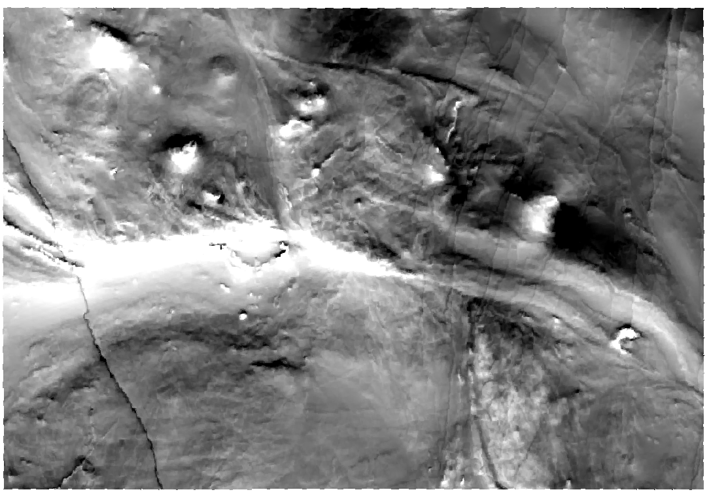

<em><strong>_RTP</strong></em>
</th>
</tr>
</thead>
<tbody>
</tbody>
</table>

**Continuation \[ \_UC\_# or \_DC\_# \]**

*UC enhances larger structures and features in area. DC (but never below
land surface) enhances near surface signal. Also needed for stitching
surveys at different heights.*

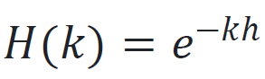  
Where  
h \> 0 for upward continuation.  
h \< 0 for downward continuation.

<table>
<colgroup>
<col style="width: 33%" />
<col style="width: 33%" />
<col style="width: 33%" />
</colgroup>
<thead>
<tr>
<th style="text-align: center;">

<em><strong>ogrm_usgs_mag_tmi</strong></em>
</th>
<th style="text-align: center;">
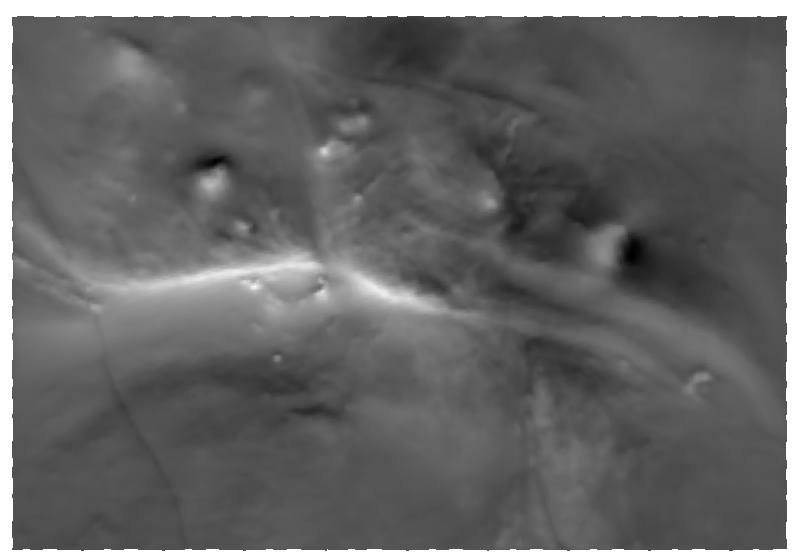

<em><strong>_RTP_UC_500</strong></em>
</th>
<th style="text-align: center;">
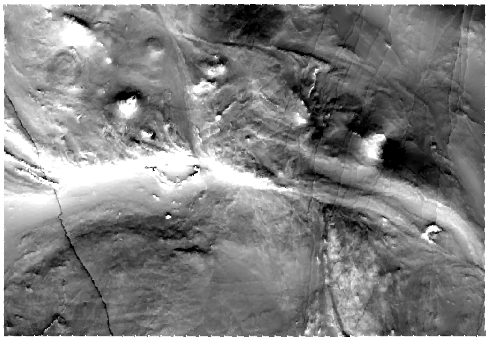

<em><strong>_RTP_DC_50</strong></em>
</th>
</tr>
</thead>
<tbody>
</tbody>
</table>

**Vertical Integration \[ \_VI \]**

*Highlights larger structures and features, such as terrane boundaries
and intrusions; good when joining two surveys with very different line
spacing. When combined with RTP or RTE of Mag data produces so-called
Pseudo Gravity images. Loses high frequency information.*

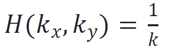  
When applied to an RTE or RTP image provides the so called Pseudogravity
result  
Where  
k = sqrt{kx2 + ky2} .

<table>
<colgroup>
<col style="width: 50%" />
<col style="width: 49%" />
</colgroup>
<thead>
<tr>
<th style="text-align: center;">

<em><strong>ogrm_usgs_mag_tmi</strong></em>
</th>
<th style="text-align: center;">
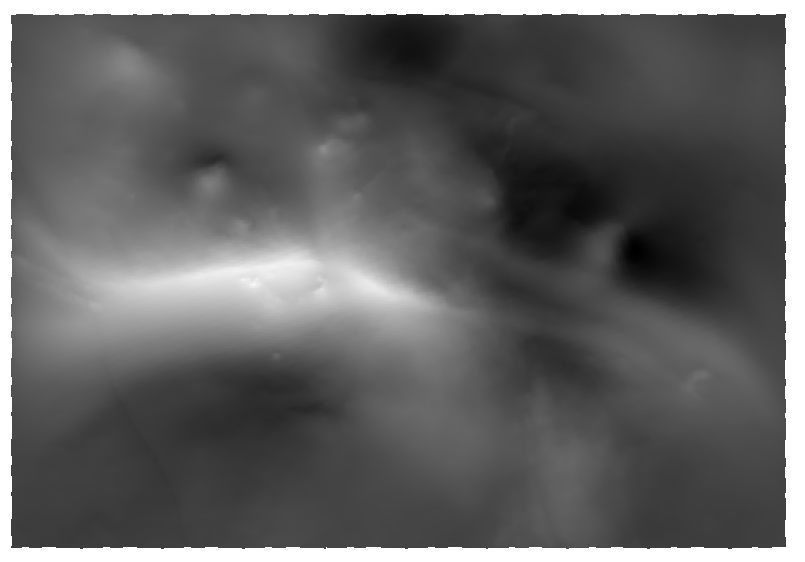

<em><strong>_RTP_VI</strong></em>
</th>
</tr>
</thead>
<tbody>
</tbody>
</table>

Frequency Filters

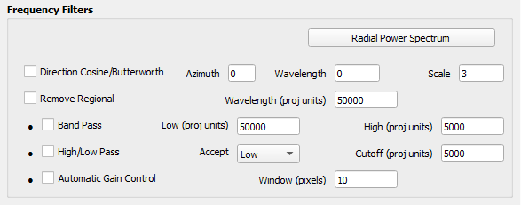

*High pass Fourier Domain filters have a tendency to create a ringing
effect in grids, especially near the edges of the grid, this can be
suppressed by using a Low pass filter with a cutoff 4 times the cell
size.*

**Band Pass** **\[ \_BP\_#\_# \]**

*Restricts wavelengths to be within a given range. There is a partial
relationship between frequency and depth of source (high frequency
signals are near surface, low frequency signals can be low gradient
variations near the surface or can be deep). People use this to do
“depth slicing” of different layers but as
frequency-depth is only a partial correlation (and potential field data
is in any case inherently ambiguous) it is only a guide to depths.*

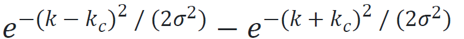

The band-pass filter retains frequencies within a specified range,
suppressing both low and high frequencies outside this range. Where

kc : The central frequency of the band.

sigma : The width of the frequency band.

<table>
<colgroup>
<col style="width: 49%" />
<col style="width: 50%" />
</colgroup>
<thead>
<tr>
<th style="text-align: center;">

<em><strong>ogrm_usgs_mag_tmi</strong></em>
</th>
<th style="text-align: center;">
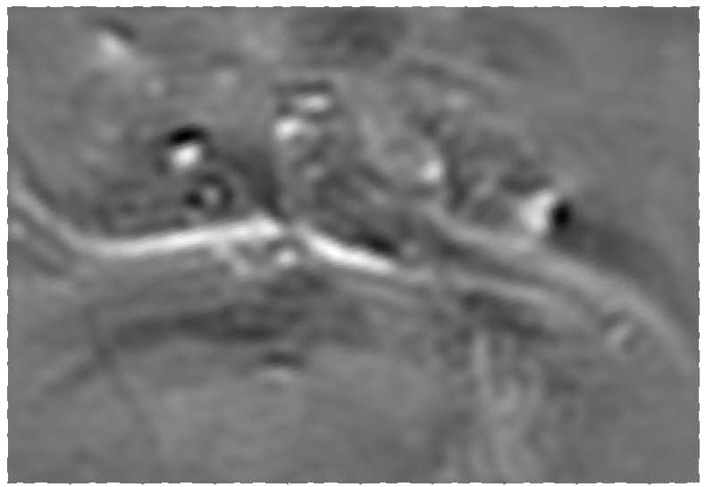

<em><strong>_RTP_BP_50000_5000</strong></em>
</th>
</tr>
</thead>
<tbody>
</tbody>
</table>

**Directional Cosine Filter \[ \_DirC \]**

*Suppresses linear features in a given direction (using a Direction
Cosine filter) and wavelength (using a Butterworth High Pass filter),
very useful for reducing line noise in airborne data. Should be applied
prior to any other filtering if line noise is an issue.*

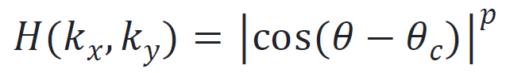  
The Directional Cosine Filter suppresses frequency components along a
specific direction.  
H(kx, ky): Filter response as a function of
wavenumber components kx and ky.  
theta = \arctan\left(\frac{k_y}{k_x}\right) : Angle of the frequency
component.  
thetac : Center direction (in radians), representing the
direction to emphasize.  
p : Degree of the cosine function. Higher ( p ) sharpens the directional
emphasis.

Wavelength typically 4 x line spacing

Scale allows you to control how much of the filtered grid should be
subtracted from original image (final image = original image – (scale \*
filtered image)

<table>
<colgroup>
<col style="width: 49%" />
<col style="width: 50%" />
</colgroup>
<thead>
<tr>
<th style="text-align: center;">
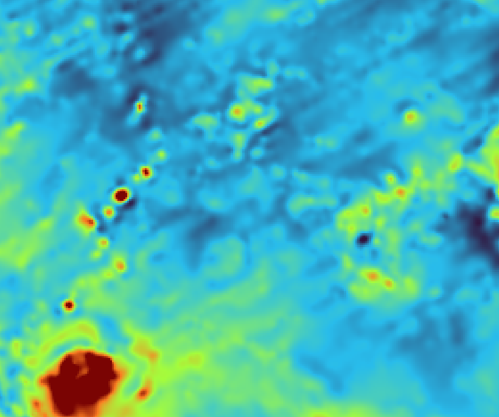

<em><strong>Mag with 060 trending flight line
noise</strong></em>
</th>
<th style="text-align: center;">
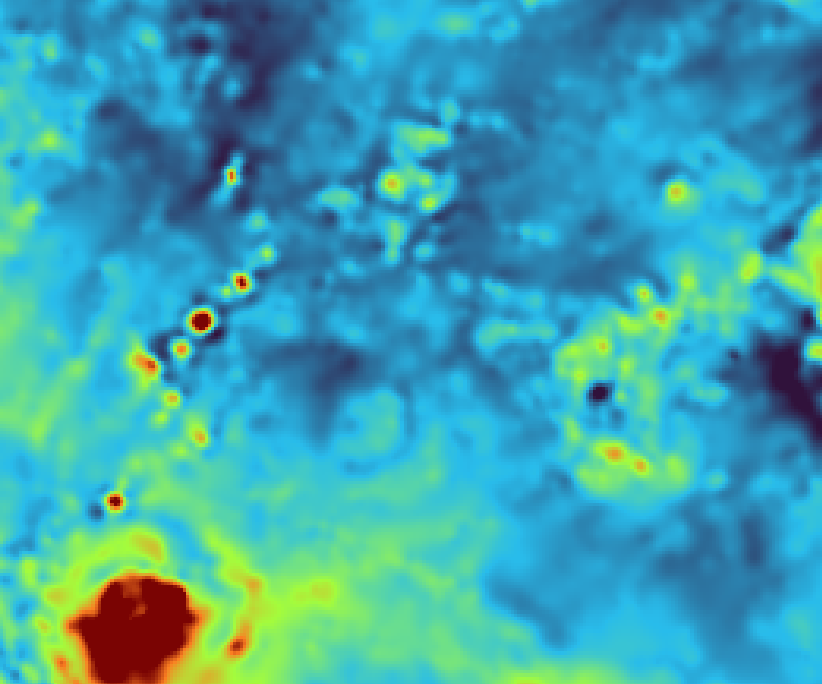

<em><strong>_DirC</strong></em>
</th>
</tr>
</thead>
<tbody>
</tbody>
</table>

**High Pass \[ \_HP\_# \]**

*Restricts wavelengths to be below a given value. Useful for
highlighting shallower features.*

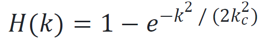  
The high-pass filter removes low-frequency components (long wavelengths)
while retaining high-frequency components (short wavelengths). Where  
kc : The cutoff frequency where the filter begins attenuating
lower frequencies.

<table>
<colgroup>
<col style="width: 50%" />
<col style="width: 49%" />
</colgroup>
<thead>
<tr>
<th style="text-align: center;">

<em><strong>ogrm_usgs_mag_tmi</strong></em>
</th>
<th style="text-align: center;">
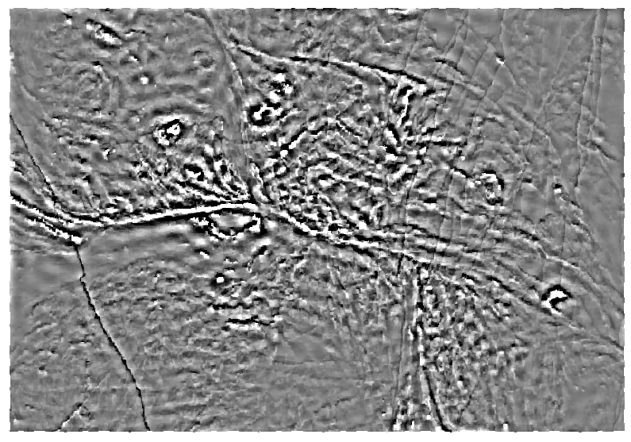

<em><strong>_RTP_HP_5000</strong></em>
</th>
</tr>
</thead>
<tbody>
</tbody>
</table>

**Low Pass \[ \_LP\_# \]**

*Restricts wavelengths to be above a given value. Useful for
highlighting ?deeper? features..*

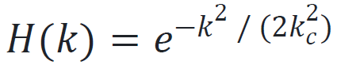  
The low-pass filter suppresses high-frequency components (short
wavelengths) while preserving low-frequency components (long
wavelengths). Where: kc : The cutoff frequency where the
filter begins attenuating higher frequencies.

<table>
<colgroup>
<col style="width: 50%" />
<col style="width: 49%" />
</colgroup>
<thead>
<tr>
<th style="text-align: center;">

<em><strong>ogrm_usgs_mag_tmi</strong></em>
</th>
<th style="text-align: center;">
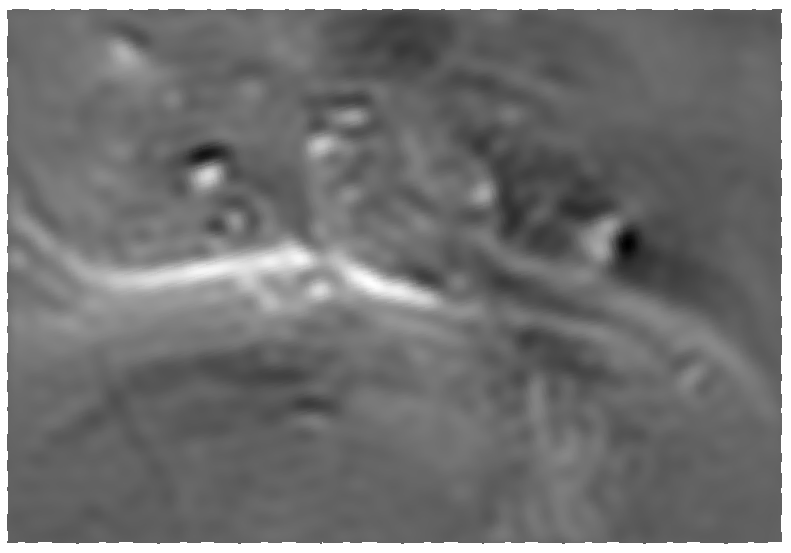

<em><strong>_RTP_LP_5000</strong></em>
</th>
</tr>
</thead>
<tbody>
</tbody>
</table>

**Remove Regional \[ \_RR\_# \]**

*Subtracts low pass filtered data from original to highlight shorter
wavelength features.*

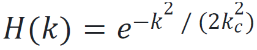

The low-pass filter suppresses high-frequency components (short
wavelengths) while preserving low-frequency components (long
wavelengths). Where  
kc : The cutoff frequency where the filter begins attenuating
higher frequencies.

Final Image = Original Image – *H(k)*

<table>
<colgroup>
<col style="width: 50%" />
<col style="width: 49%" />
</colgroup>
<thead>
<tr>
<th style="text-align: center;">

<em><strong>ogrm_usgs_mag_tmi</strong></em>
</th>
<th style="text-align: center;">
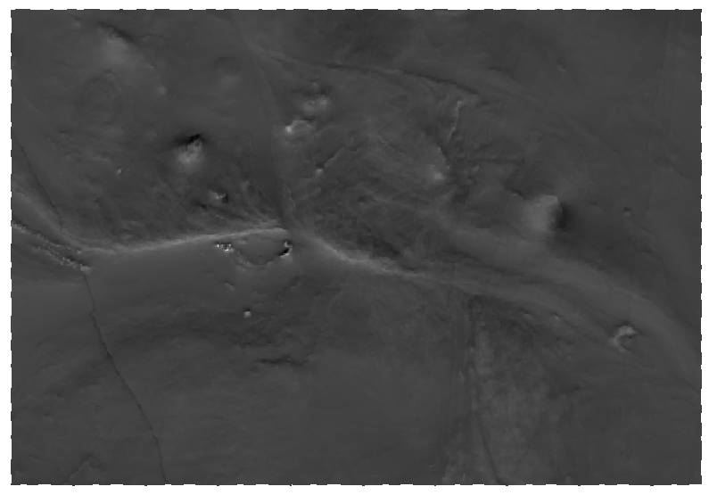

<em><strong>_RTP_RR_50000</strong></em>
</th>
</tr>
</thead>
<tbody>
</tbody>
</table>

**Automatic Gain Control \[ \_AGC \]  
***Further highlights near-surface geology and high frequency features
in magnetically 'quiet' areas of geology, usually viewed in grayscale.
Often makes high frequency mag areas hard to interpret. Uses include:*

1.  *Highlighting other features in areas with highly magnetic rocks
    such as Banded Iron Formations (BIF) in an area of lower magnetic
    susceptibility.*

2.  *Enhancement of subtle structures withing otherwise quiet
    sedimentary basins.*

3.  *Ultramafic rocks in a greenstone belt with thick sedimentary rock
    packages to better discern contacts in the mafic-ultramafic
    sequence.*

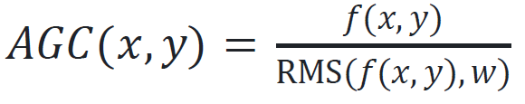

Where  
RMS(f, w) is the root mean square of the data over a window w.

<table>
<colgroup>
<col style="width: 50%" />
<col style="width: 49%" />
</colgroup>
<thead>
<tr>
<th style="text-align: center;">

<em><strong>ogrm_usgs_mag_tmi</strong></em>
</th>
<th style="text-align: center;">
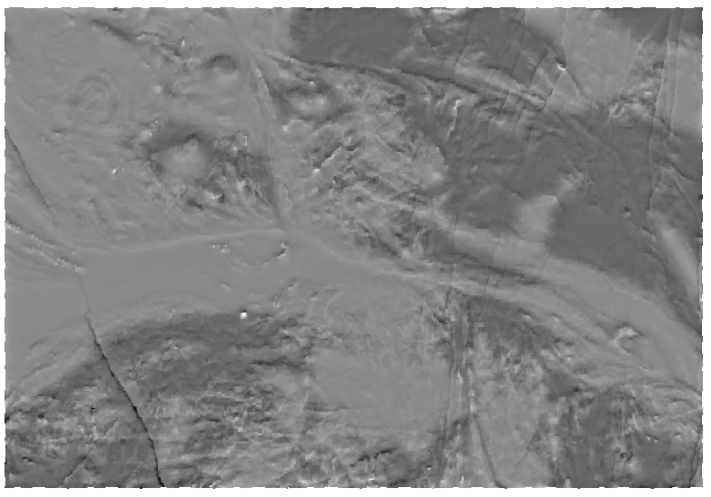

<em><strong>_RTP_AG</strong></em>
</th>
</tr>
</thead>
<tbody>
</tbody>
</table>

**Radially averaged power spectrum**  
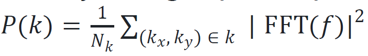

Where  
P(k) is the radially averaged power spectrum, and Nk is the
number of samples in the radial bin.

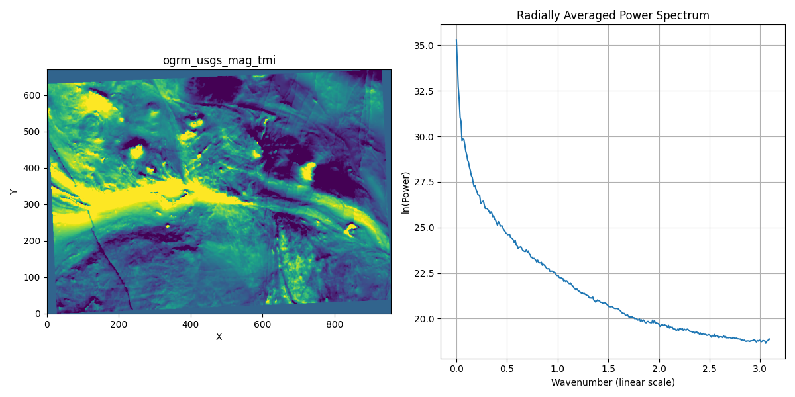

Gradient Filters

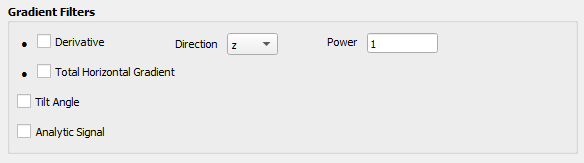

**Derivative \[ \_d# \]**

*Calculates spatial gradient (or derivative) of field in x, y or z
direction to 1 or more orders. Vertical derivative in z direction
highlights near-surface geology and high frequency features, and images
are usually viewed in grayscale. The vertical gradient of field is
derived from the two horizontal gradients, based on the knowledge that
grav/mag fields are Greens Functions. Vertical derivative images show
low-high-low triple anomaly for narrow linear magnetic features.*

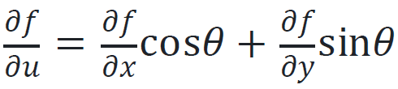  
Where  
theta is the angle defining the direction of the derivative (x,y or z).

<table>
<colgroup>
<col style="width: 49%" />
<col style="width: 50%" />
</colgroup>
<thead>
<tr>
<th style="text-align: center;">

<em><strong>ogrm_usgs_mag_tmi</strong></em>
</th>
<th style="text-align: center;">
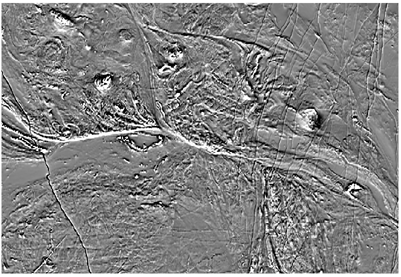

<em><strong>_RTP_d1z</strong></em>
</th>
</tr>
</thead>
<tbody>
</tbody>
</table>

**Total Horizontal Gradient \[ \_THG \]**

*Calculates maximum spatial gradient of the field in x and y directions,
and highlights contacts and is often used to better locate very deep
boundaries, such as MT and seismic tomography.*

~~  
~~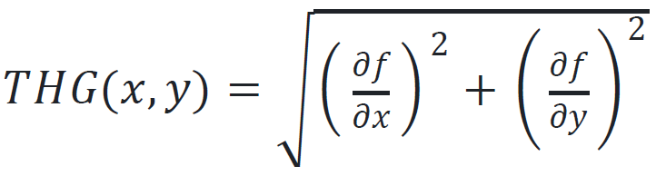

<table>
<colgroup>
<col style="width: 49%" />
<col style="width: 50%" />
</colgroup>
<thead>
<tr>
<th style="text-align: center;">

<em><strong>ogrm_usgs_mag_tmi</strong></em>
</th>
<th style="text-align: center;">
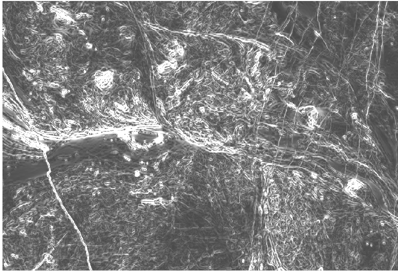

<em><strong>_RTP_THG</strong></em>
</th>
</tr>
</thead>
<tbody>
</tbody>
</table>

**Analytic Signal \[ \_AS \]  
**

*Reflects total amount of magnetic or density material beneath surface.
Tends to 'over-join' features so not great on its own for understanding
structures, but good for lithostratigraphic analysis.*

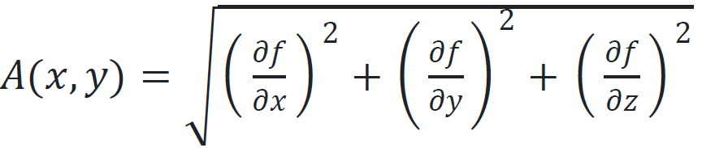

Computes the total amplitude of the gradients, independent of field
inclination or declination. Useful for locating edges of potential field
sources (e.g. faults or contacts).

<table>
<colgroup>
<col style="width: 49%" />
<col style="width: 50%" />
</colgroup>
<thead>
<tr>
<th style="text-align: center;">

<em><strong>ogrm_usgs_mag_tmi</strong></em>
</th>
<th style="text-align: center;">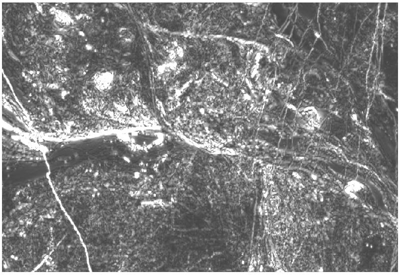<em><strong>_RTP_AS</strong></em></th>
</tr>
</thead>
<tbody>
</tbody>
</table>

**Tilt Angle \[ \_TA \]  
**

*Highlights near-surface geology and high-frequency features (i.e. is
not applicable to use for long wavelength components); usually viewed in
grayscale. Tends to 'over-join' features so not always great on its own
for understanding structural relationships and applying an **\_1vd_AGC**
combination can produce cleaner results.*

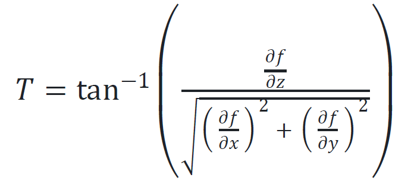

Enhances the contrast of geological features by highlighting gradients
relative to the vertical component. Where  
df/dz : Vertical derivative of the field. df/dx , df/dy : Horizontal
derivatives of the field.

<table>
<colgroup>
<col style="width: 49%" />
<col style="width: 50%" />
</colgroup>
<thead>
<tr>
<th style="text-align: center;">

<em><strong>ogrm_usgs_mag_tmi</strong></em>
</th>
<th style="text-align: center;">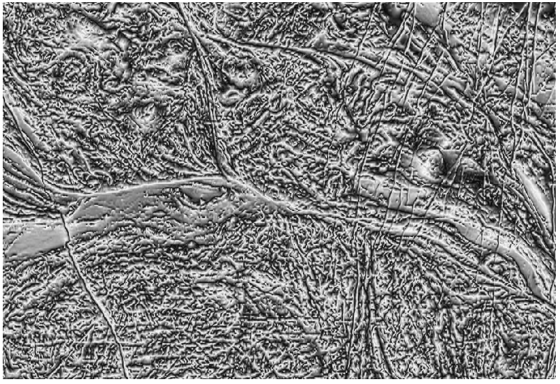<em><strong>_RTP_TA</strong></em></th>
</tr>
</thead>
<tbody>
</tbody>
</table>

Convolution Filters

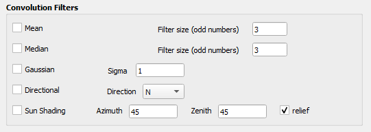

**Mean** Applies a mean filter using a kernel of size n x n. **\[ \_Mn
\]**

*Smooths data*

<table>
<colgroup>
<col style="width: 49%" />
<col style="width: 50%" />
</colgroup>
<thead>
<tr>
<th style="text-align: center;">

<em><strong>ogrm_usgs_mag_tmi</strong></em>
</th>
<th style="text-align: center;">
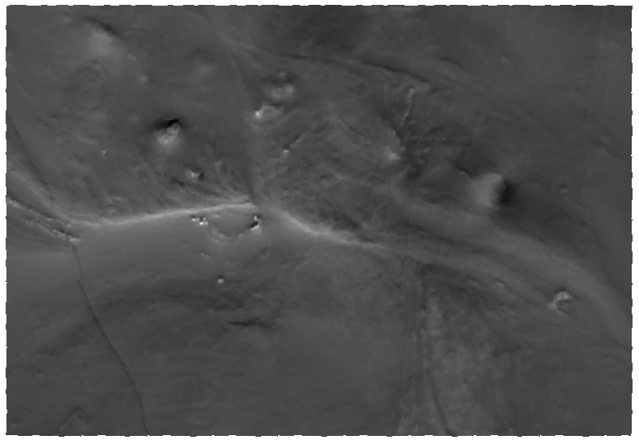

<em><strong>_RTP_Mn</strong></em>
</th>
</tr>
</thead>
<tbody>
</tbody>
</table>

**Median**  
Applies a median filter using a kernel of size n x n. **\[ \_Md \]**

*Removes high frequency noise from data.*

<table>
<colgroup>
<col style="width: 49%" />
<col style="width: 50%" />
</colgroup>
<thead>
<tr>
<th style="text-align: center;">

<em><strong>ogrm_usgs_mag_tmi</strong></em>
</th>
<th style="text-align: center;">
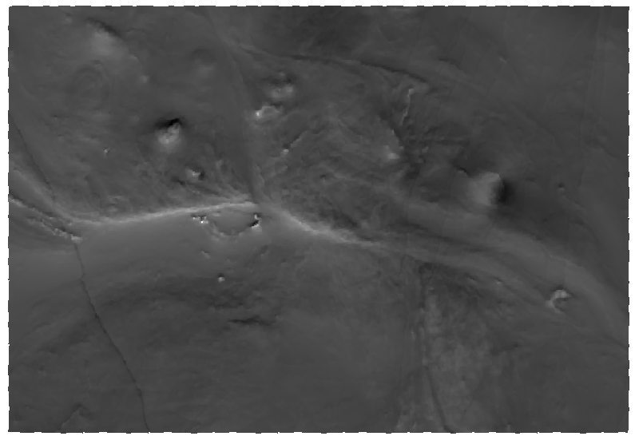

<em><strong>_RTP_Md</strong></em>
</th>
</tr>
</thead>
<tbody>
</tbody>
</table>

**Gaussian**  
Applies a Gaussian (smoothing) filter with a specified standard
deviation. **\[ \_Gs \]**

*Smooths data*

<table>
<colgroup>
<col style="width: 49%" />
<col style="width: 50%" />
</colgroup>
<thead>
<tr>
<th style="text-align: center;">

<em><strong>ogrm_usgs_mag_tmi</strong></em>
</th>
<th style="text-align: center;">
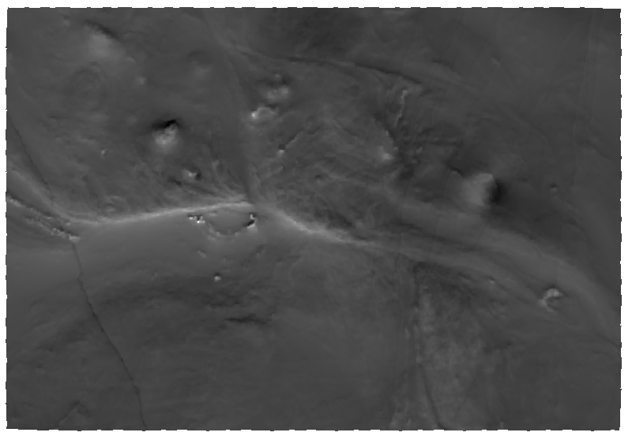

<em><strong>_RTP_Gs</strong></em>
</th>
</tr>
</thead>
<tbody>
</tbody>
</table>

**Directional**  
Apply directional filter (NE, N, NW, W, SW, S, SE, E) **\[ \_Dr \]**

*Highlights specific orientations in data.*

<table>
<colgroup>
<col style="width: 49%" />
<col style="width: 50%" />
</colgroup>
<thead>
<tr>
<th style="text-align: center;">

<em><strong>ogrm_usgs_mag_tmi</strong></em>
</th>
<th style="text-align: center;">
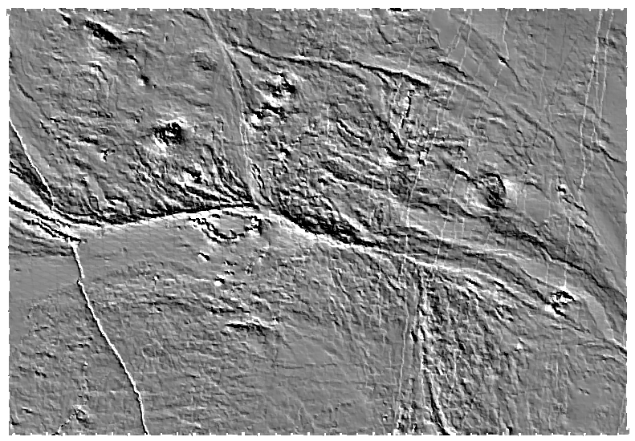

<em><strong>_RTP_Dr (South)</strong></em>
</th>
</tr>
</thead>
<tbody>
</tbody>
</table>

**Sun Shading**  
Computes relief shading for a digital elevation model (DEM) or other 2D
grids. Azimuth provides the direction of the “sun” and zenith its angle
from horizontal. **\[ \_Sh \]**

*A form of directional high pass filtering which accentuates high
frequency information, but offsets the peaks of anomalies, so use with
caution. Sometimes a zenith of 90 causes problems, so it is limited
internally to 88 degrees. The (by default) checked box for **relief**
gives a softer shading that is well suited to Digital Terrain Models
(examples below for Sun angle of 315/45).*

<table>
<colgroup>
<col style="width: 100%" />
</colgroup>
<thead>
<tr>
<th style="text-align: center;">
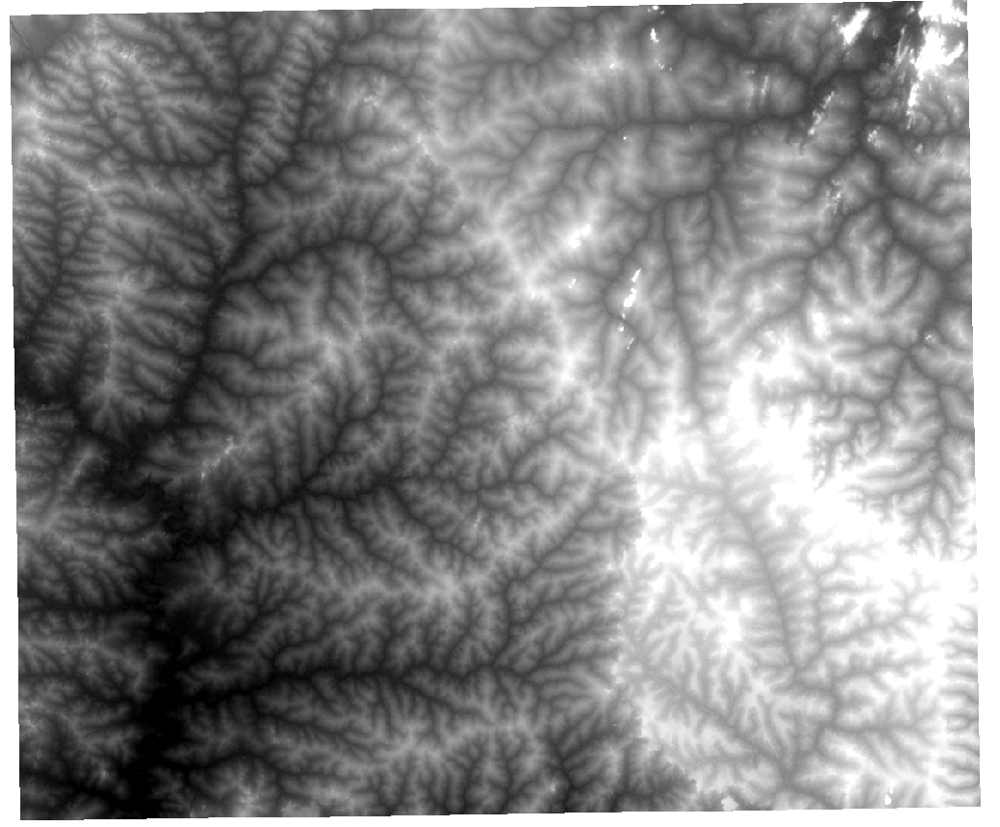

<em><strong>SRTM data from Burkina Faso</strong></em>
</th>
</tr>
</thead>
<tbody>
</tbody>
</table>

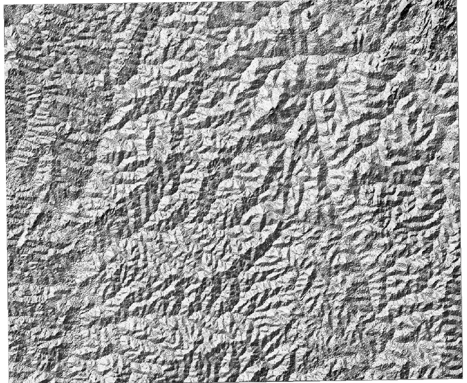
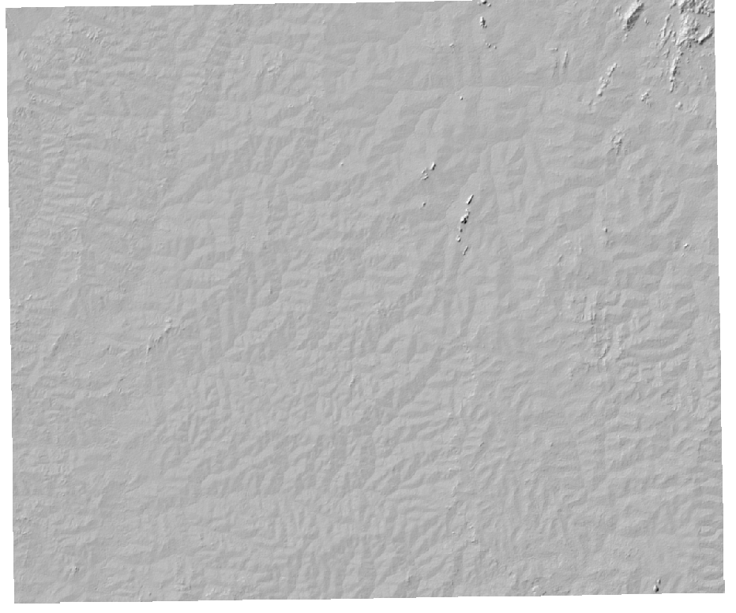

*relief not checked relief checked*

Spatial Statistics

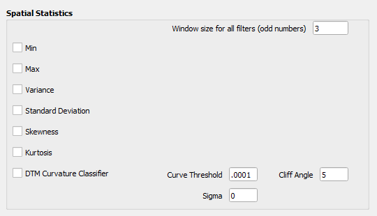

Calculates 1D statistics in a windowed grid

***Window size** defines local area for stats (masked to be circular to
lessen grid anisotropy). The larger the window size the slower the
calculation, but probably the more meaningful the result, especially for
the StdDev, Variance, Kurtosis & Skewness calcs*

**Min** **\[ \_SS_Min \]**  
Calculate Minimum of values within a given circular window size.

<table>
<colgroup>
<col style="width: 50%" />
<col style="width: 49%" />
</colgroup>
<thead>
<tr>
<th style="text-align: center;">

<em><strong>ogrm_usgs_mag_tmi</strong></em>
</th>
<th style="text-align: center;">
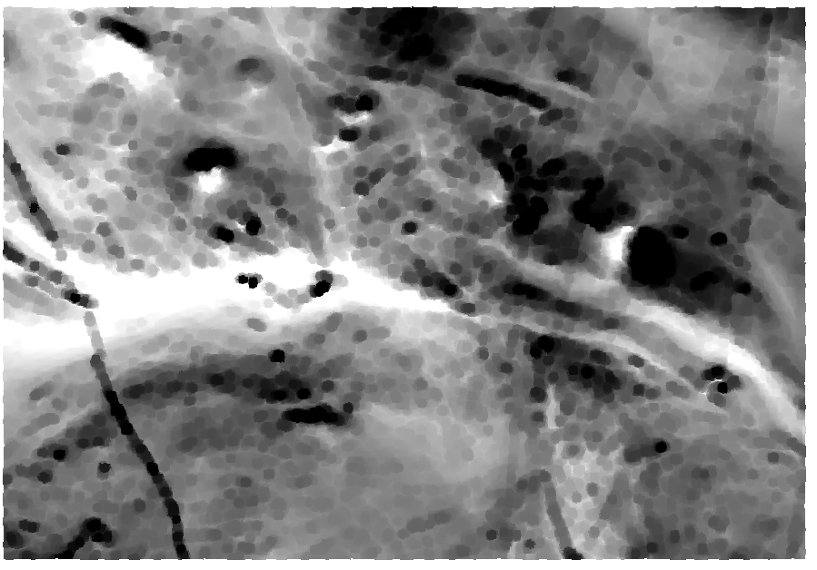

<em><strong>_SS_Min</strong></em>
</th>
</tr>
</thead>
<tbody>
</tbody>
</table>

**Max** **\[ \_ SS_Max \]**  
Calculate Maximum of values within a given circular window size.

<table>
<colgroup>
<col style="width: 49%" />
<col style="width: 50%" />
</colgroup>
<thead>
<tr>
<th style="text-align: center;">

<em><strong>ogrm_usgs_mag_tmi</strong></em>
</th>
<th style="text-align: center;">
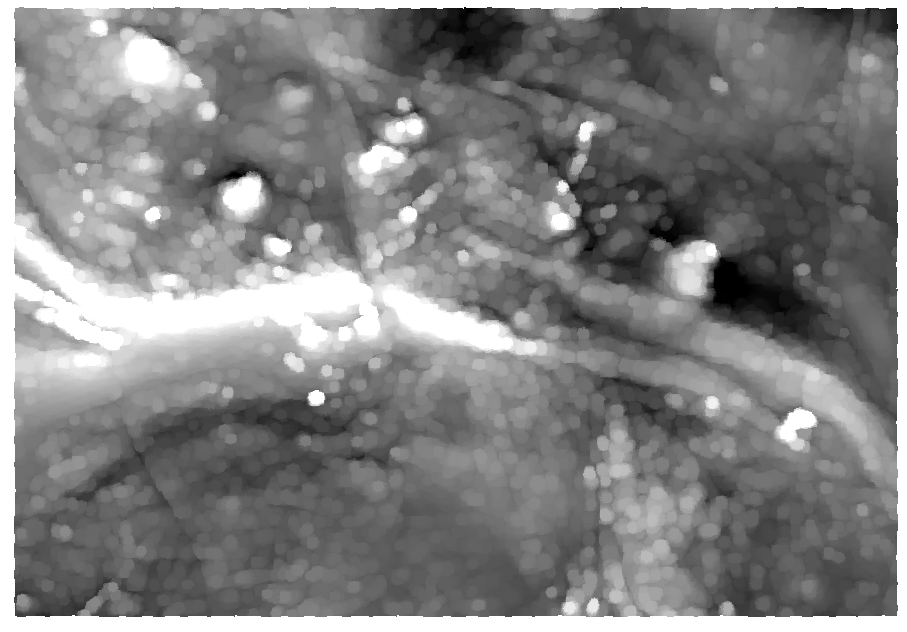

<em><strong>_SS_Max</strong></em>
</th>
</tr>
</thead>
<tbody>
</tbody>
</table>

**Standard Deviation** **\[ \_ SS_StdDev \]**  
Calculate Standard Deviation of values within a given circular window
size. Slow for large windows or grid sizes.

<table>
<colgroup>
<col style="width: 50%" />
<col style="width: 49%" />
</colgroup>
<thead>
<tr>
<th style="text-align: center;">

<em><strong>ogrm_usgs_mag_tmi</strong></em>
</th>
<th style="text-align: center;">
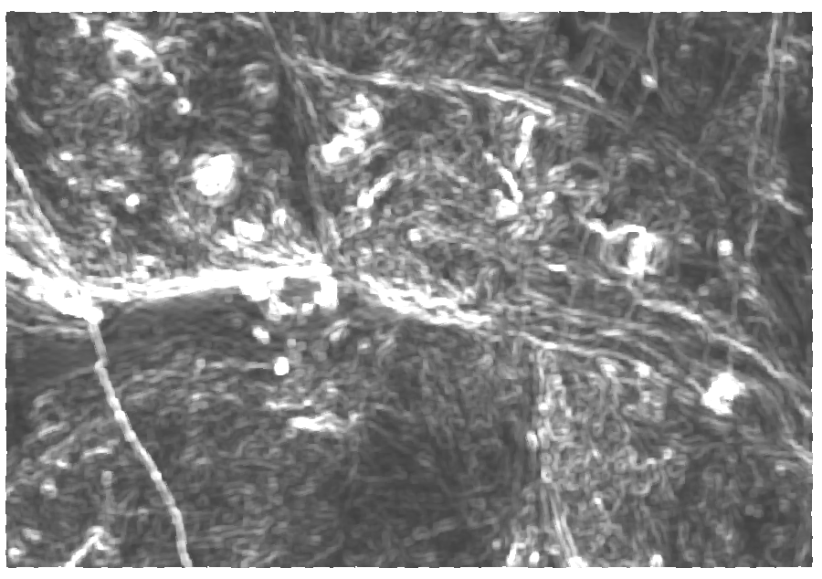

<em><strong>_SS_StdDev</strong></em>
</th>
</tr>
</thead>
<tbody>
</tbody>
</table>

**Variance** **\[ \_ SS_Var \]**  
Calculate Variance of values within a given circular window size. Slow
for large windows or grid sizes.

<table>
<colgroup>
<col style="width: 49%" />
<col style="width: 50%" />
</colgroup>
<thead>
<tr>
<th style="text-align: center;">

<em><strong>ogrm_usgs_mag_tmi</strong></em>
</th>
<th style="text-align: center;">
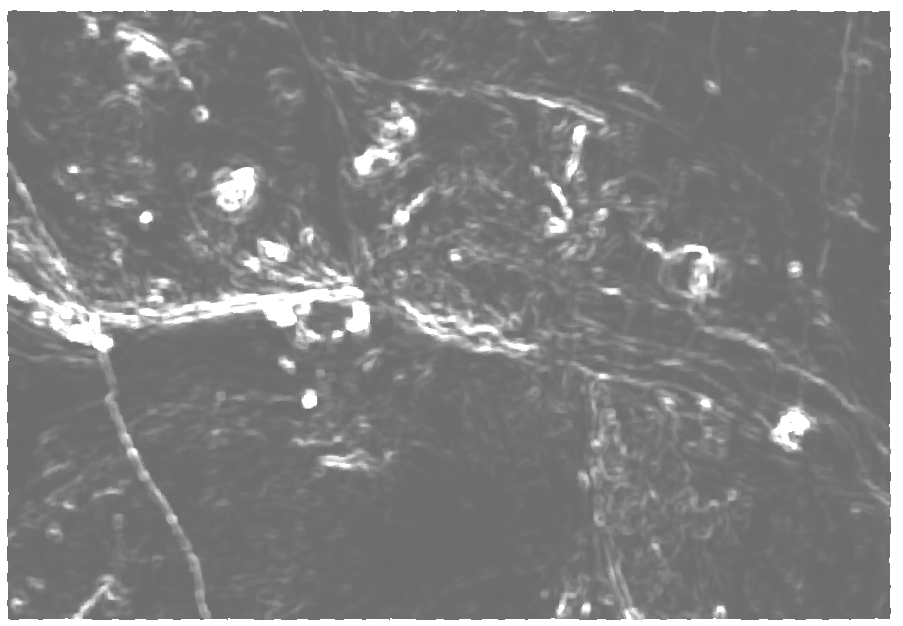

<em><strong>_SS_Var</strong></em>
</th>
</tr>
</thead>
<tbody>
</tbody>
</table>

**Kurtosis** **\[ \_ SS_Kurt \]**  
Calculate Kurtosis of values within a given circular window size. Very
slow for large windows or grid sizes.

<table>
<colgroup>
<col style="width: 50%" />
<col style="width: 49%" />
</colgroup>
<thead>
<tr>
<th style="text-align: center;">

<em><strong>ogrm_usgs_mag_tmi</strong></em>
</th>
<th style="text-align: center;">
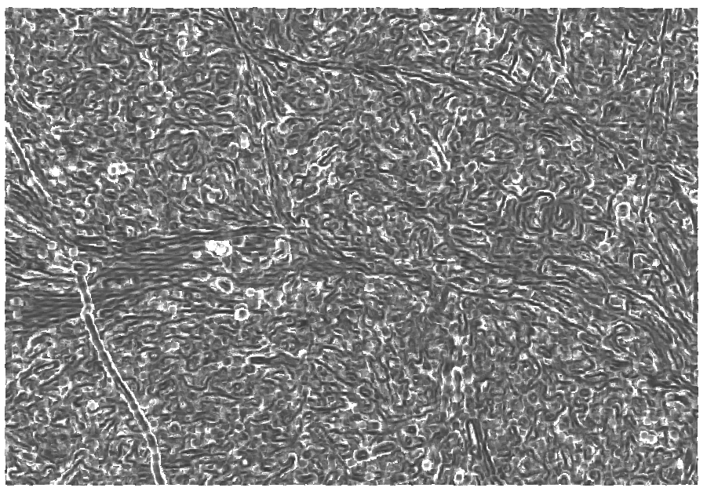

<em><strong>_SS_Kurt</strong></em>
</th>
</tr>
</thead>
<tbody>
</tbody>
</table>

**Skewness** **\[ \_ SS_Skew \]**  
Calculate Skewness of values within a given circular window size. Very
slow for large windows or grid sizes.

<table>
<colgroup>
<col style="width: 49%" />
<col style="width: 50%" />
</colgroup>
<thead>
<tr>
<th style="text-align: center;">

<em><strong>ogrm_usgs_mag_tmi</strong></em>
</th>
<th style="text-align: center;">
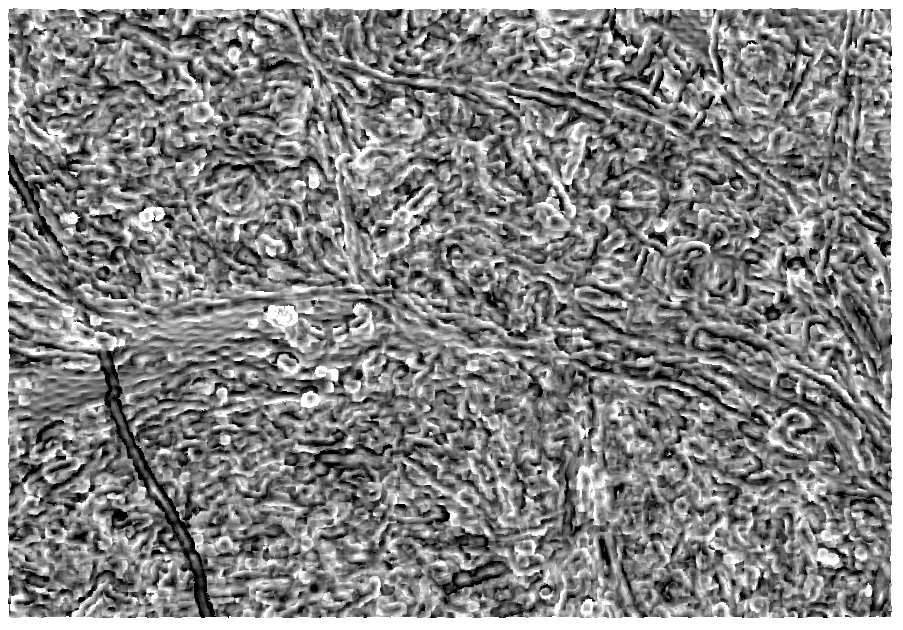

<em><strong>_SS_Skew</strong></em>
</th>
</tr>
</thead>
<tbody>
</tbody>
</table>

**DTM Curvature Classifier** **\[ \_DTM_Class \]**

Classifies Digital Terrain Model based on curvature and slope within a
given circular window size, may be useful for regolith analysis?

 

Based on **Curvature Threshold**, **Cliff Threshold**, square **Window
Size** and **Smoothing Parameter**  

Calculates classified array where:

> -1 = concave up (curvature \< -**Curvature Threshold ͡͡** )
>
> 0 = flat (curvature \> -**Curvature Threshold** and curvature \<
> **Curvature Threshold ͞͞͞͞͞͞͞͞** )
>
> 1 = convex up (curvature \> **Curvature Threshold ͝** )
>
> 2 = steep slope (“cliff”) (slope \> **Cliff Threshold ͞ ͟** )
>
> -15 = No data

   

<table style="width:50%;">
<colgroup>
<col style="width: 49%" />
</colgroup>
<thead>
<tr>
<th style="text-align: center;">

<em><strong>SRTM data from Burkina Faso</strong></em>
</th>
</tr>
</thead>
<tbody>
<tr>
<td style="text-align: center;"></td>
</tr>
</tbody>
</table>

Import point or line data

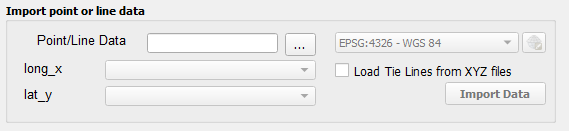

This tool allows you to import a csv file (which of course you can do
anyway in QGIS) or an XYZ format file (an ascii format that divides data
up by flight line numbers). Optionally include tie lines for the latter
option.

Gridding

This tool gets you started with gridding point data by allowing you to
select an already-loaded point file and field to be gridded and to see
the consequence of a given cell size in terms of number of rows and
columns. Full dialog for each interpolation method allows other
parameters to be set.

Wavelet Transforms

**BSDWorms**

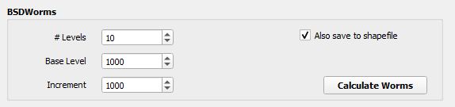

*This tool uses Frank Horowitz’s bsdwormer tool
([<u>https://bitbucket.org/fghorow/bsdwormer/</u>](https://bitbucket.org/fghorow/bsdwormer/))
to build wavelet transform “worms” for
metre-based grids. “Worms” are calculated by updward continuing the data
to different heights (levels), and calculating the peaks in the data at
each level using wavelet transforms of the horizontal gradient of the
data.*

For more information see:

> Hornby, P., Boschetti, F., Horowitz, F.G., 1999. Analysis of potential
> field data in the wavelet domain. Geophys. J. Int. 137, 175–196.
>
> Holden, D., Archibald, N., Boschetti, F., Jessell, M.W., 2000.
> Inferring geological structures using wavelet-based multiscale edge
> analysis and forward models. Explor. Geophys. 31, 617–621.

The grids must be of gravity or RTE/RTP + Vertical Integration grids of
magnetic data

This will not work for degree-based projections

**\# Levels** are the number of levels of worms to calculate

**Base Level** is the upward continuation height above 0 to calculate
the first worm level by (often the 0 level is very noisy so best
ignored, and is in any case recast as 0.01 to avoid problems)

Increment provides the spacing in metres the data is upward continued
between levels

Worms are saved out in the same directory as the original grid as a
single csv file (originalfilename_worms.csv) that can be loaded into
QGIS or a 3D renderer such as Mira Geoscience’s Geoscience Analyst

Worms can also optionally be saved out as polyline shapefiles (by
checking on the (**Also save to shapefile** checkbox), which are much
better for viewing in QGIS (but will take longer to calculate). The
shapefile can be clipped to the extent of the grid using the standard
QGIS vector Clip tool, and using the polygon produced by the **Create
Clipping Polygon** tool in the **Utils** tab.

A padded version of the grid is also saved out and this can be removed
after the worms are calculated but is provided for debugging purposes.

<table>
<colgroup>
<col style="width: 50%" />
<col style="width: 49%" />
</colgroup>
<thead>
<tr>
<th style="text-align: center;">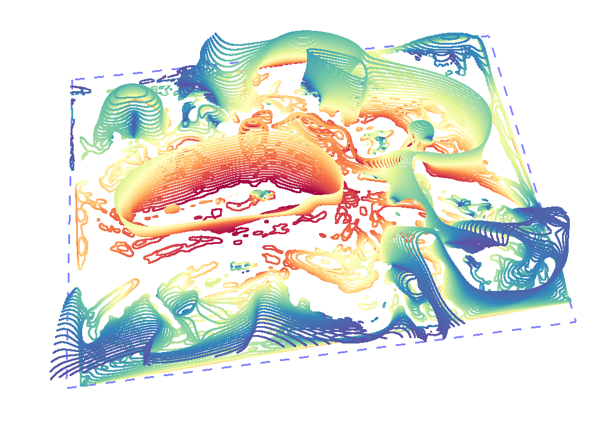<em><strong>_RTP_VI_worms (visualised in
GeoscienceAnalyst)</strong></em></th>
<th style="text-align: center;"><blockquote>

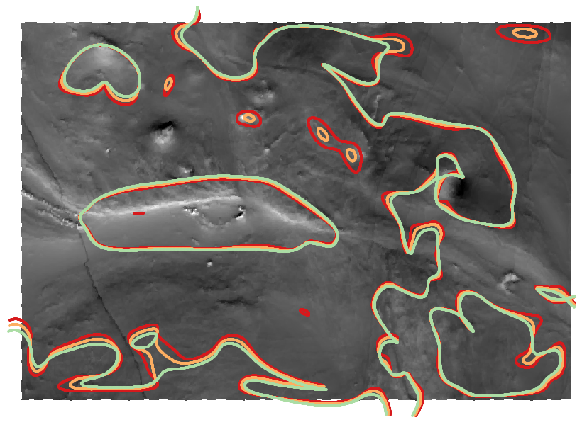
<em><strong>_RTP_VI_worms in QGIS (selected z levels)</strong></em>

</blockquote></th>
</tr>
</thead>
<tbody>
</tbody>
</table>

**Wavelet Transform Modulus Maxima (WTMM)**

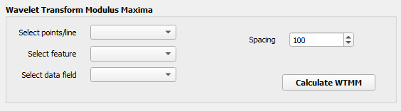

Use wavelet transforms to build multilevel analysis for lines extracted
from grids, or XYZ point data

**Extract from grid**: Select grid to analyse, select one polyline
(linestring) feature from a vector layer by its FID value and select
sample spacing along line (use grid cell size as a minimum).

**Use XYZ data**: Select imported XYZ data layer, select LINE_ID to
analyse and select data field from this same layer

The **Multifractal Spectrum** D(h) plots the Hausdorff dimension D(h)
against the Hölder exponent h. This representation reveals how different
scaling behaviours coexist within a single signal:

1.  The Hölder exponent (h) measures the local regularity or roughness
    of the signal at different points. Larger h values indicate smoother
    regions, while smaller h values correspond to more irregular or
    rougher regions.

2.  The function D(h) represents the fractal dimension of the set of
    points that share the same Hölder exponent h. This tells you "how
    much" of each type of scaling behaviour exists in your signal.

The shape of the spectrum provides valuable information:

- A narrow spectrum (concentrated around a single h value) indicates
  monofractal behaviour, where the scaling properties are uniform
  throughout the signal.

- A wide spectrum suggests multifractal behaviour, where multiple
  scaling regimes coexist within the same signal.

- The peak of D(h) typically corresponds to the dominant scaling
  behaviour.

- The width of the spectrum quantifies the degree of multifractality or
  the "richness" of different scaling behaviours.

**Scalograms** are visual representations in wavelet analysis that
display how the energy or power of a signal is distributed across
different scales (frequencies) and space positions using a scaled
representation of a Continuous Wavelet Transformation (CWT) performed on
the original signal. The CWT generates several values that correspond to
the correlation between the signal and an example wave at different
frequencies — at present we use the Mexican Hat wavelet. The
**Cladogram** picks out the skeletal features of the scalogram. 

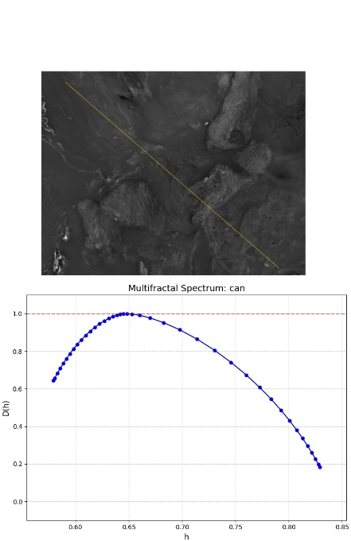
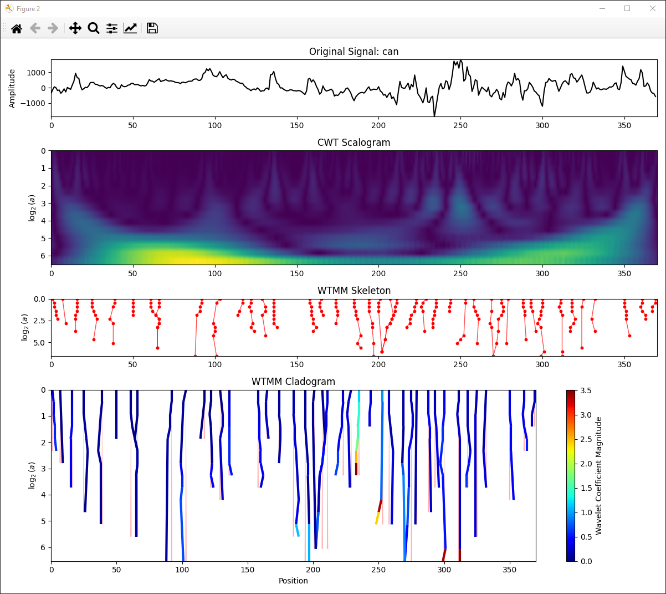

Utilities

**Threshold to NaN** **\[ \_Clean \]**

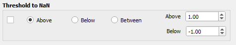

This tool allows you to define NaN (aka NULL aka None) values based on a
thresholding approach which is useful when an imported grid has a margin
that should not be used in calculations. You can define an upper value
beyond which all pixels are set to NaN, a lower value beyond which all
pixels are set to NaN, or an upper and lower bound between which values
are set to NaN.

The suffix **\[ \_Clean \]** is added to the layer name

<table>
<colgroup>
<col style="width: 49%" />
<col style="width: 50%" />
</colgroup>
<thead>
<tr>
<th style="text-align: center;">
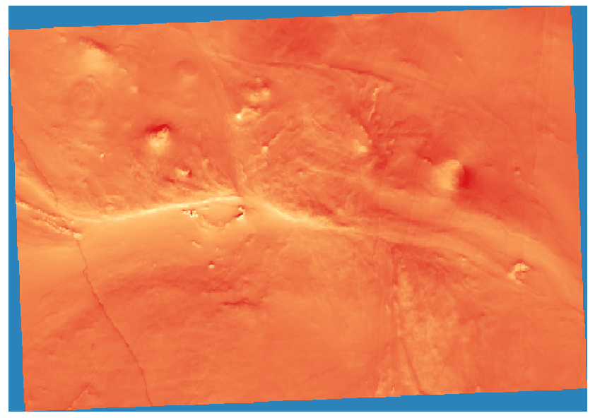

<em><strong>Image with border</strong></em>
</th>
<th style="text-align: center;">
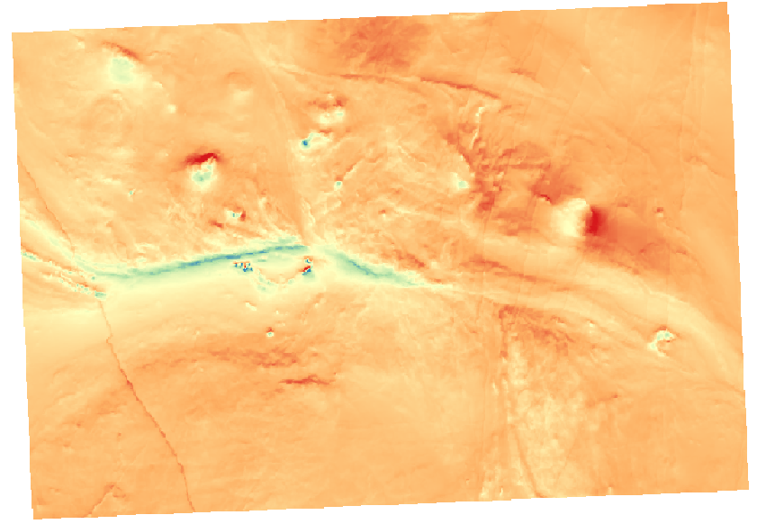

<em><strong>Image with border reset to NaN</strong></em>
</th>
</tr>
</thead>
<tbody>
</tbody>
</table>

**Create Clipping Polygon**

This tool creates a temporary layer \[ ***layername*\_boundaries** \]
with one or more polygons, with interior holes if relevant, that outline
the area of available data in a grid (i.e. ignore areas of No Data or
NaN). This is useful, amongst other things, for clipping worms to the
available data using the **QGIS Raster-\>Extraction-\>Clip Raster by
Mask Layer...** tool.

<table>
<colgroup>
<col style="width: 49%" />
<col style="width: 50%" />
</colgroup>
<thead>
<tr>
<th style="text-align: center;">
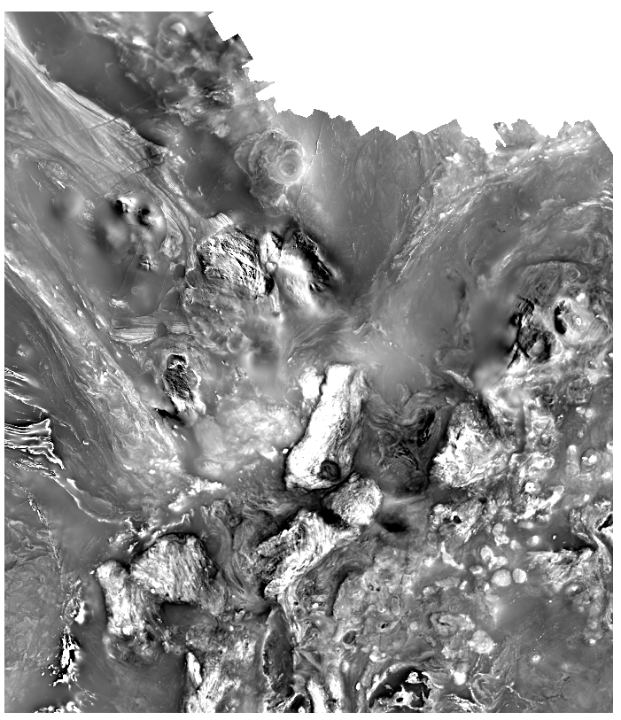

<em><strong>Grid with irregular boundaries</strong></em>
</th>
<th style="text-align: center;">
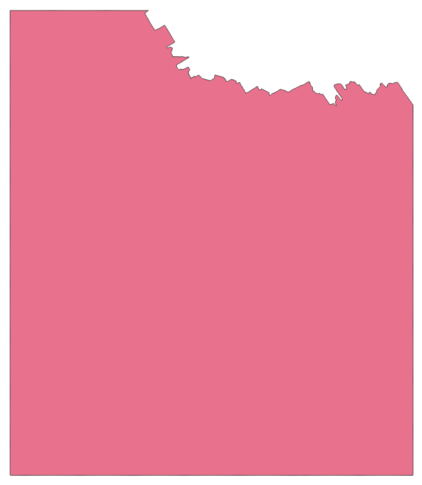

<em><strong>Masking polygon</strong></em>
</th>
</tr>
</thead>
<tbody>
</tbody>
</table>

**Normalise Grids**

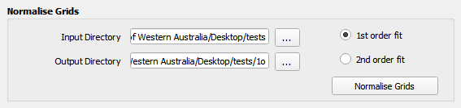

This function loads a directory of geotiffs and attempts to reduce the
mismatches between the grids so that they can be stitched into a single
grid. The user needs to supply **input** and **output** directories.

1)  <u>Assumes same processing</u> level for grids e.g. RTE or RTP

2)  <u>Assumes flight heights have been standardised</u> by upward or
    downward continuation

3)  In the merge tool, <u>all grids in merge need to have the same
    projection</u>

4)  The normalise function uses the alphabetically first file in the
    directory to define the standard deviation of the output grids,
    which are all set to approximately zero mean.

5)  A regional is removed from each grid, either first order (a best-fit
    flat plane) or second order (which is slower, and removes a best-fit
    polynomial function)

6)  Once normalized, the QGIS merge tool produced a reasonable stitch of
    the grids for interpretation, but not inversion, purposes.

7)  The merge tool uses the alphabetically first file to define cell
    size

<table>
<colgroup>
<col style="width: 32%" />
<col style="width: 33%" />
<col style="width: 33%" />
</colgroup>
<thead>
<tr>
<th style="text-align: center;">
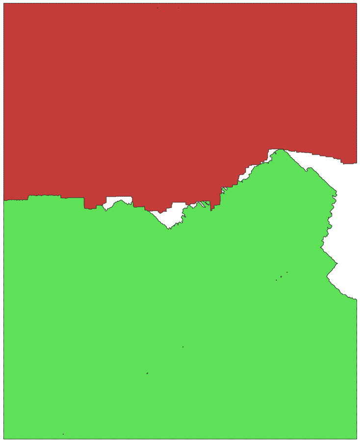

Extent of two grids
</th>
<th style="text-align: center;">
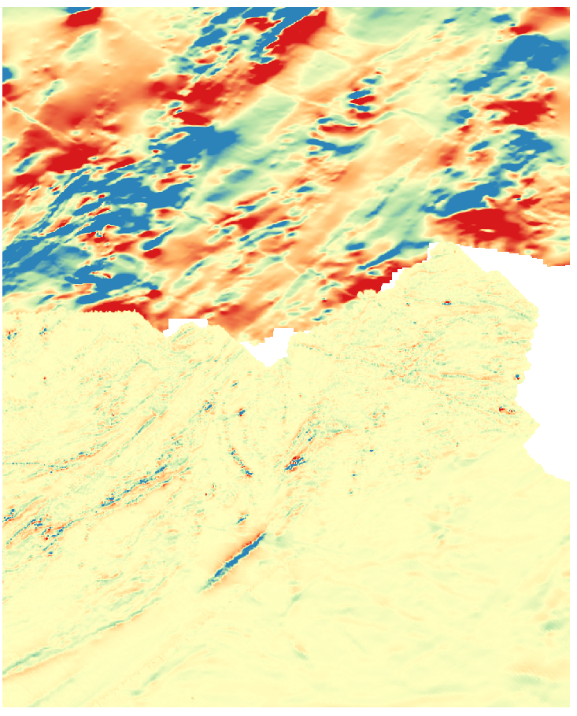

Two merged grids, note different dynamic range of the two
grids
</th>
<th style="text-align: center;">
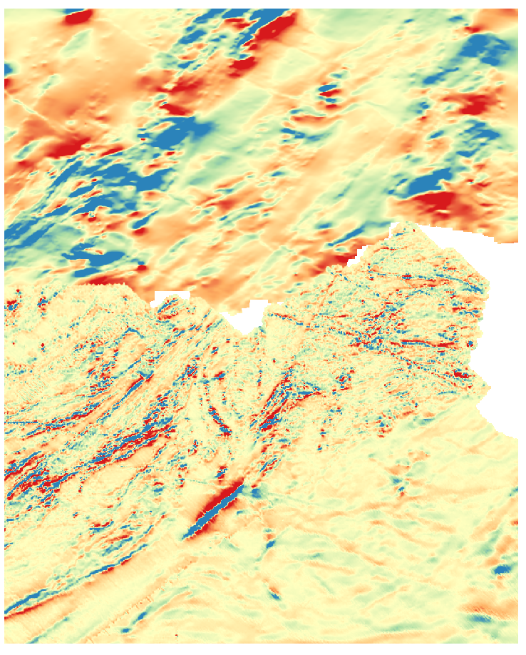

Two grids, normalised and merged, note that the resolutions have been
harmonised but there is still more detail in the lower grid. To fix this
the lower grid could be rescaled to the resolution of the upper grid
prior to merging.
</th>
</tr>
</thead>
<tbody>
</tbody>
</table>

**RGB Importer** **\[ \_gray \]**

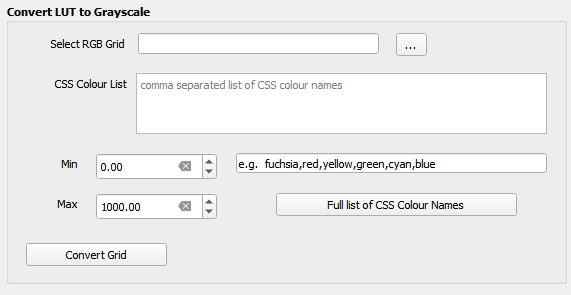

This tool takes a 3-band RGB image of some data and attempts to convert
it to a monotonically increasing 1-band grid. The user provides the
sequence of colours seen in the look up table using colour names from
the CSS colour list as provided by matplotlib.

**Please respect copyright restrictions on use of images!**

The **min max** values define the range of the data (if known)

It is important that the input grid has a CRS (projection system)
recognized by QGIS, otherwise the code will not work properly.

The new grid (**originalfilename_gray.tif**) is saved in the same
directory as the original grid

Assumes a linear look up table display (e.g. not histogram equalised,
quantised…)

Best <u>without</u> shading applied to image, but not awful if it has
been used

Reasonably close colour choice required.

Rename existing grey scale extract so you can try different colour
lists, as you can’t overwrite current layer

If you are not sure of the colours to select you can ask ChatGPT or
similar the following query together with uploading a screenshot of the
lookup table, assuming it is available:

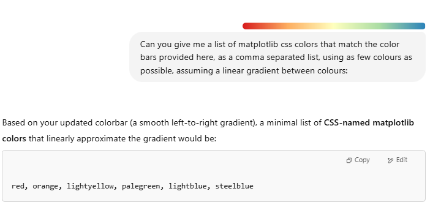

The resulting image usually needs a Gaussian filter to be applied first
if high pass filters are to be used, and you may try to reduce the
number of colours to say, ***red, lightyellow, steelblue*** to see if
that improves things.

*CSS Colour Names*
[<u>https://matplotlib.org/stable/gallery/color/named_colors.html#css-colors</u>](https://matplotlib.org/stable/gallery/color/named_colors.html#css-colors)

***  
Example usage***

*The original greyscale representation of a 1-band TMI grid (image
approximately 110 km across) :*

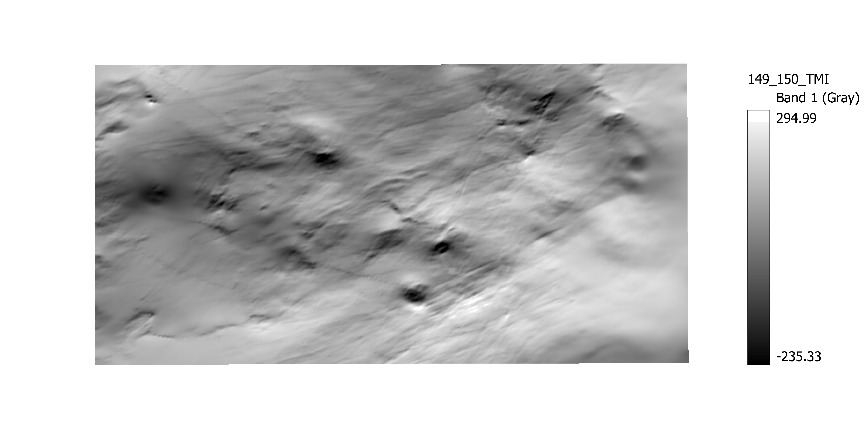

> *The colour representation of a 1-band TMI grid (QGIS Spectral LUT).
> <u>This image is saved out as a 3-band RGB representation</u>:*

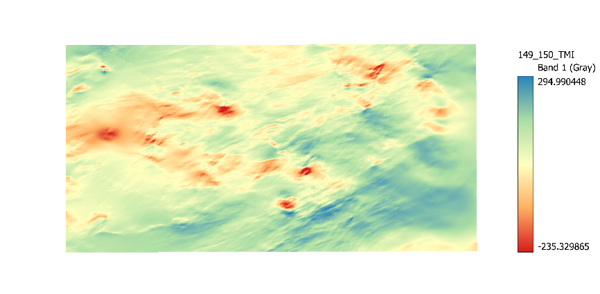

> *The greyscale representation extracted from the 3-band RGB using the
> colour LUT sequence \[teal, lemonchiffon, red\] :*
>
> 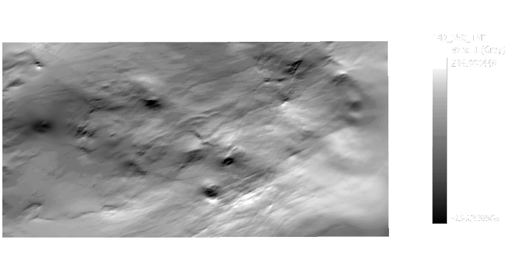 alt="P480#yIS1" />

*The colour representation of a the extracted TMI grid (QGIS Spectral
LUT).*

> 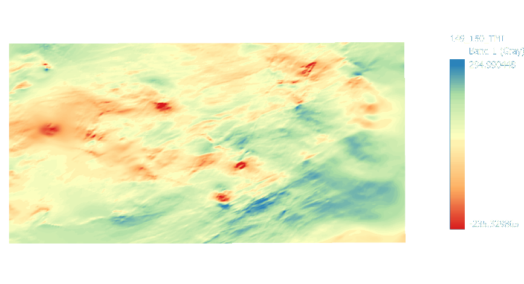 alt="P482#yIS1" />

*Comparison between Vertical Integration of original data (left) and
extracted data (right)*

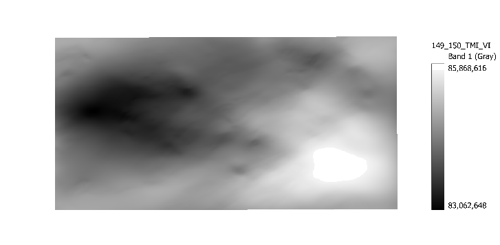
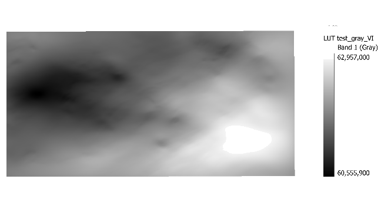

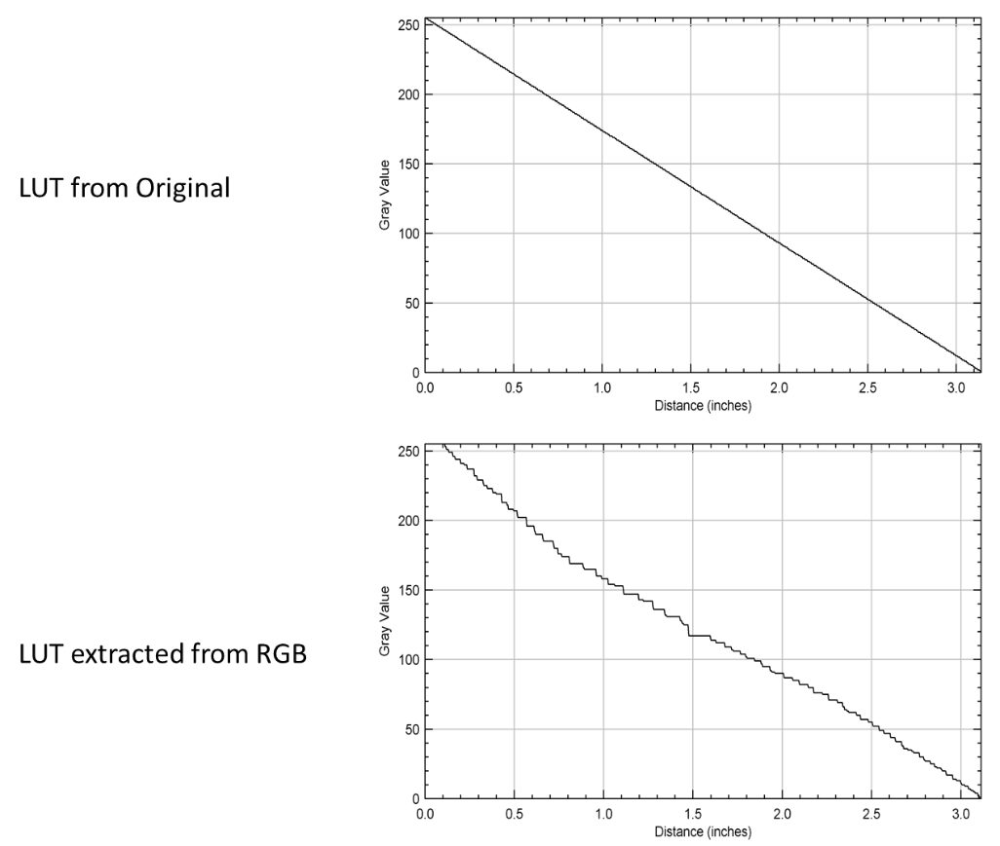

*Comparison between original data LUT and data LUT extracted from RGB
image*

Code development

*This code is developed using QGIS 3.34.1 but has been tested on
versions back to 3.24.0. It appears to fail to install on significantly
older versions (e.g. 3.4.0).*

> \- Calculations — ChatGPT and Mark Jessell
>
> \- Plugin construction—Mark Jessell using QGIS Plugin Builder Plugin,
> https://g-sherman.github.io/QGIS-Plugin-Builder/
>
> \- IGRF calculation—pyIGRF https://github.com/ciaranbe/pyIGRF
>
> \- GRD Loader, RTP & Radially averaged power spectrum — Fatiando a
> Terra crew (https://www.fatiando.org/) and & Mark Jessell
>
> \- Example geophysics data in image above courtesy of Mauritania
> Government, <https://anarpam.mr/en/> Second Projet de Renforcement
> Institutionnel du Secteur Minier de la République Islamique de
> Mauritanie (PRISM-II) Phase V, Open-File Report 2013-1280, Prepared in
> cooperation with the Ministry of Petroleum, Energy, and Mines of the
> Islamic Republic of Mauritania, Edited by: Cliff D. Taylor,
> <https://doi.org/10.3133/ofr20131280>
>
> \- Worming of grids —Frank Horowitz's bsdwormer
> <https://bitbucket.org/fghorow/bsdwormer/>
>
> \- Wavelet Transform base code - <https://github.com/PyWavelets/pywt>
>
> \- Thanks to Lyal Harris for extensive beta testing and suggestions!

Examples

> **Example data available here:
> <http://tectonique.net/sgtools_data/ogrm_usgs_mag_tmi.tif>**
>
> Example geophysics data in image above courtesy of Mauritania
> Government in cooperation with the USGS, <https://anarpam.mr/en/>
>
> Second Projet de Renforcement Institutionnel du Secteur Minier de la
> République Islamique de Mauritanie (PRISM-II) Phase V, Open-File
> Report 2013-1280, Prepared in cooperation with the Ministry of
> Petroleum, Energy, and Mines of the Islamic Republic of Mauritania,
> Edited by: Cliff D. Taylor, <https://doi.org/10.3133/ofr20131280>

<table>
<colgroup>
<col style="width: 33%" />
<col style="width: 33%" />
<col style="width: 33%" />
</colgroup>
<thead>
<tr>
<th style="text-align: center;">

<em><strong>ogrm_usgs_mag_tmi</strong></em>
</th>
<th style="text-align: center;">

<em><strong>_RTP</strong></em>
</th>
<th style="text-align: center;">

<em><strong>_RTP_VI</strong></em>
</th>
</tr>
</thead>
<tbody>
<tr>
<td style="text-align: center;">

<em><strong>_RTP_UC_500</strong></em>
</td>
<td style="text-align: center;">
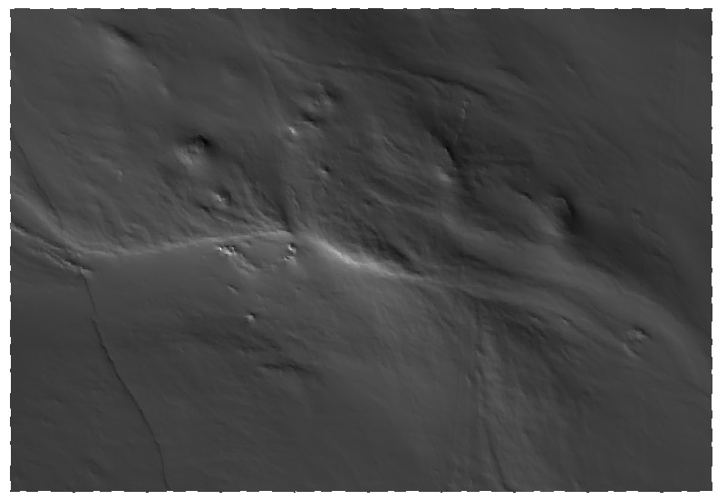

<em><strong>_RTP_DirC</strong></em>
</td>
<td style="text-align: center;">

<em><strong>_RTP_RR_50000</strong></em>
</td>
</tr>
<tr>
<td style="text-align: center;">

<em><strong>_RTP_BP_50000_5000</strong></em>
</td>
<td style="text-align: center;">

<em><strong>_RTP_LP_5000</strong></em>
</td>
<td style="text-align: center;">

<em><strong>_RTP_HP_5000</strong></em>
</td>
</tr>
<tr>
<td style="text-align: center;">

<em><strong>_RTP_AGC</strong></em>
</td>
<td style="text-align: center;">

<em><strong>_RTP_d1z</strong></em>
</td>
<td style="text-align: center;">

<em><strong>_RTP_THG</strong></em>
</td>
</tr>
<tr>
<td style="text-align: center;">

<em><strong>_RTP_TA</strong></em>
</td>
<td style="text-align: center;">

<em><strong>_RTP_AS</strong></em>
</td>
<td style="text-align: center;">

<em><strong>_RTP_Mn</strong></em>
</td>
</tr>
<tr>
<td style="text-align: center;">

<em><strong>_RTP_Md</strong></em>
</td>
<td style="text-align: center;">

<em><strong>_RTP_Gs</strong></em>
</td>
<td style="text-align: center;">

<em><strong>_RTP_Dr</strong></em>
</td>
</tr>
<tr>
<td style="text-align: center;">
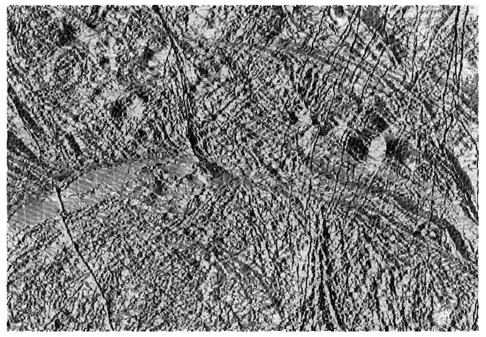

<em><strong>_RTP_Sh</strong></em>
</td>
<td style="text-align: center;">

<em><strong>_RTP_border</strong></em>
</td>
<td style="text-align: center;">

<em><strong>_RTP_border_Clean</strong></em>
</td>
</tr>
<tr>
<td style="text-align: center;"><em><strong>_SS_Min</strong></em></td>
<td style="text-align: center;"><em><strong>_SS_Max</strong></em></td>
<td style="text-align: center;"><em><strong>_SS_Var</strong></em></td>
</tr>
<tr>
<td style="text-align: center;"><em><strong>_SS_StdDev</strong></em></td>
<td style="text-align: center;"><em><strong>_SS_Skew</strong></em></td>
<td style="text-align: center;"><em><strong>_SS_Kurt</strong></em></td>
</tr>
<tr>
<td style="text-align: center;">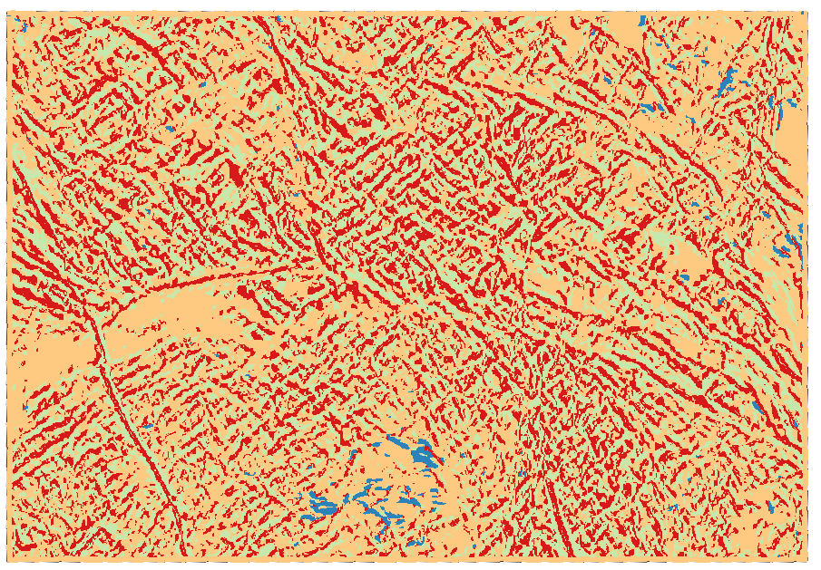
<em><strong>_DTM_Class</strong></em></td>
<td style="text-align: center;"><em><strong>_RTP_VI_worms (visualised in
GeoscienceAnalyst)</strong></em></td>
<td style="text-align: center;"><blockquote>

<em><strong>_RTP_VI_worms in QGIS (selected z levels)</strong></em>

</blockquote></td>
</tr>
<tr>
<td style="text-align: center;"></td>
<td style="text-align: center;"></td>
<td style="text-align: center;"></td>
</tr>
</tbody>
</table>
